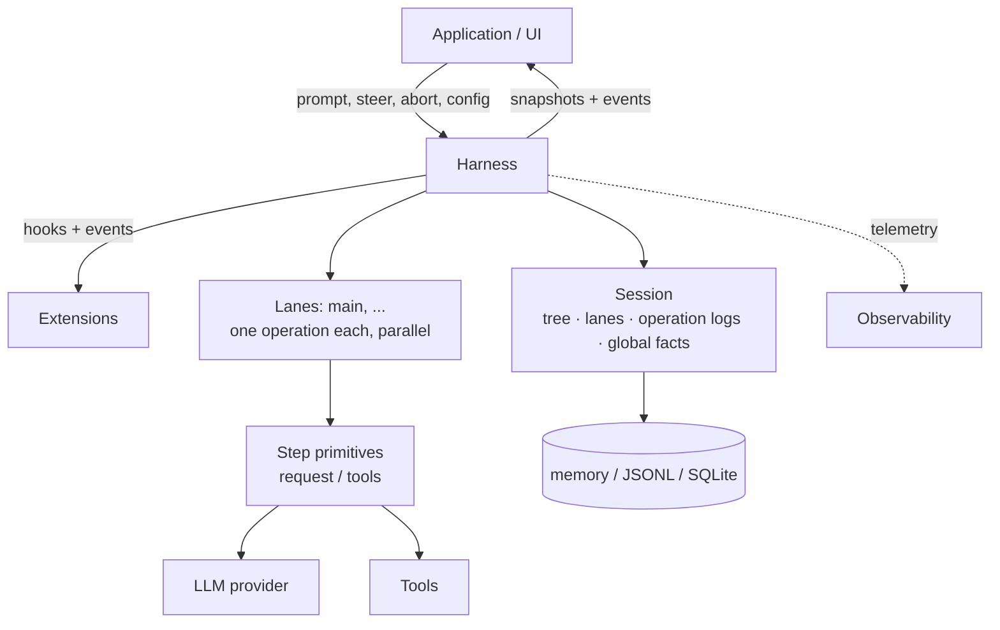
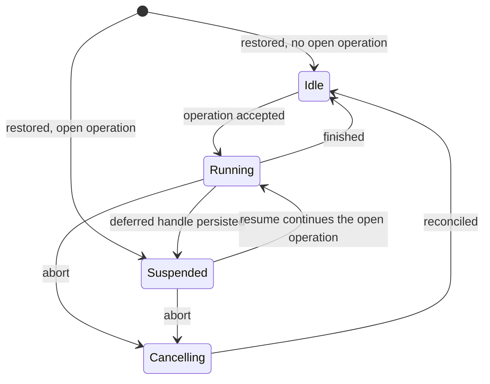

# Durable AgentHarness design

> **Compatibility policy.** Old coding-agent v3 JSONL sessions must open and restore idle. This is the only backward-compatibility requirement. All other formats and APIs in `packages/agent/src/harness` and `packages/storage/sqlite-node` (and their respective tests) may break. We do not write migrations, schema versioning, or conversion paths for anything else.



The harness executes runs against one session. The session holds four kinds of state (section 2). Lanes execute in parallel inside one harness (section 3). Storage backends encode the session (Part III).

# Part I — Concepts

## 1. Goals

- **Durable runs.** An accepted prompt is a durable operation. After a crash, a new process restores the session. It resumes the run from the last safe boundary. Every state that a crash can produce is recoverable.
- **Lanes.** A session hosts one or more lanes. A lane is a named position in the conversation tree. Each lane runs at most one operation at a time. Lanes run in parallel. A run and its queued messages belong to the lane that accepted them. Example: a Slack channel is a session; each thread is a lane. Interactive pi uses one lane and does not show the concept in its UI. Extensions get the full harness API, including lanes. Example: a subagent tool runs on a second lane of its parent's session.
- **No partial outcomes.** A crash inside any operation — run, compaction, navigation — leaves one of two states: the operation has not happened, or recovery can complete it. Nothing in between is observable.
- **Harness API.** Events observe execution and cannot change it. Hooks intercept execution and can change it: context, requests, tools, run boundaries. Extensions build on events and hooks.
- **Observability.** All execution is instrumentable for logging and tracing, down to provider request and response internals. This channel is separate from the hook system.
- **UI model.** A client gets one atomic snapshot, then a live event stream. Events are not replayed. Reconnect means a new snapshot.
- **Single writer.** One harness writes a session at a time. The serving layer enforces this. All lanes of a session live in that one harness. Restore treats states that a single writer cannot produce as corruption.
- **v3 sessions load.** Old coding-agent v3 JSONL files open unchanged and restore idle.

## Non-goals

- **Exactly-once hook side effects.** State a hook hands to the harness is durable when the call resolves: queued messages, appended entries. Side effects a hook makes on its own are invisible to the harness: HTTP calls, file writes. Interrupted handlers are not re-run on resume. A hook that needs crash-safe external effects must be idempotent, for example keyed by operation id.
- **Provider stream resumption.** Partial streams are never persisted. An interrupted streaming request is retried or abandoned. Deferred requests are different and in scope: the provider returns a handle at once and serves the result later (e.g. `background: true` on a Responses API, batch APIs). pi-ai returns an assistant message with stop reason `deferred` that carries the handle; it is persisted like any assistant message. Redeeming the handle appends a normal assistant message. Recovery sees the unredeemed handle and fetches instead of paying for a new request.
- **Multiple writers.** Two processes on one session are out of scope. The serving layer routes all traffic for a session to the process that holds its harness. Lanes cover the workloads that look like multi-writer: parallel threads over shared history.
- **Replication.** A session lives in one place. Coordination-free sync of diverging copies is a different design. Parked; see open questions.

## 2. What a session is

A session is durable state with four parts:

1. **The tree** — the conversation. Entries with `parentId` links: messages, model/thinking/tool-activation changes, compaction summaries, branch summaries, custom entries. The tree is shared and passive. It belongs to no lane. It only grows; entries are never changed or deleted.
2. **Lanes** — where work happens. A lane is a name plus a leaf: the entry that future work extends. Every session has the lane `main`. Applications create more, keyed by external identity (a Slack thread id, an email thread id).
3. **Lane operation logs** — what happened and what must happen. One flat, chronological record sequence per lane: operation started, task attempted, tool started, message queued, operation finished. This is where durability is implemented: records exist so that a new process can continue a lane's work after a crash. Nothing reads them during normal execution.
4. **Global facts** — session-scoped values where the latest write wins: the session name, entry labels. Not part of the tree. Kept as append-only history; readers see the newest value.

All writes across the four parts share one monotonic sequence number. The sequence orders global-fact history and lets a lane's operation log refer to tree positions.

```text
tree (shared, append-only)          lanes
a ── b ── c ── d                    main            → d   (op log: …)
      └── e ── f                    slack:171943…   → f   (op log: …)

global facts: name = "Refactor auth", label(b) = "checkpoint-1"
```

### Active and passive

The tree and the global facts are passive: shared data, readable by anything.

A lane is active. It owns its leaf, its operation log (at most one open operation), its queues, and its pending writes. Two lanes never share any of these. Every action of a lane produces entries chained to its leaf, or records in its own operation log.

### Invariants

- The tree is conversation only. No lane state, no orchestration state, no pointers live in it.
- An entry's parent chain never changes. Branches share prefixes; nothing is copied.
- A lane's leaf moves in exactly two ways: the lane appends an entry (leaf becomes that entry), or the lane navigates (leaf jumps to an existing entry).
- Operation-log records never affect the tree. Deleting every operation log leaves a complete, valid conversation.
- At most one operation is open per lane. A state where one lane has two open operations is corruption.
- Entries are shared; records are not. Two lanes may have the same entry on their paths. A record belongs to exactly one lane.

Records are not tree entries because they describe execution, not conversation: they must never enter model context, transcripts, branch queries, or forks, and within one lane their order is already their meaning — parent links would add nothing.

## 3. Lanes

A lane is a named position in the tree plus the work serialized on it. The closest existing concept is a git branch checked out in its own worktree: a name attached to a position, advanced by new work, movable to any entry without rewriting history, and never checked out twice. One difference to git intuition: navigation moves a lane to any entry, not only forward.

Every session has the lane `main`. `main` cannot be deleted. Applications create further lanes with a name and an anchor entry. Lane names are application keys: a Slack thread id, an email thread id. No UI lists lanes in the abstract; the platform's own UI (the thread list) plays that role.

A lane owns:

- **Its leaf.** New entries chain to it and move it. Navigation jumps it.
- **Its operation log.** At most one open operation. A second operation on a busy lane is rejected; other lanes are unaffected.
- **Its queues.** Steering, follow-ups, and next-run messages target one lane.
- **Its configuration view.** Model, thinking level, and active tools are entries on the path behind the lane's leaf. Two lanes can run different models without knowing of each other. Tool implementations, resources, and stream options are harness-global; only their activation is per-lane.

Rules:

- Lanes run operations in parallel. The harness stays the single writer; lane records and entries interleave in the shared sequence.
- Creating a lane copies nothing. Deleting a lane deletes its name, its queues, and its operation log — never entries.
- Two lanes at the same leaf diverge on their next append. The tree handles this; no coordination exists between lanes.
- A lane with an unfinished operation restores as suspended, independently of its siblings. Suspension has a reason: crash, or a deferred provider request (section 1).

## 4. How work executes

### Operations

An operation is the unit of durable work on a lane. Three kinds:

- **Run** — an accepted prompt, through all automatic continuations: tool calls, steering, follow-ups, auto-compaction. Ends when nothing is pending.
- **Compaction** — replaces old context with a summary entry.
- **Navigation** — moves the lane's leaf to an existing entry, optionally with a branch summary.

An operation is accepted before it executes. Acceptance is durable: after a crash, an accepted operation is either completed by recovery or explicitly closed. Every operation ends with one outcome: `completed`, `failed`, `aborted` (stopped by abort), or `declined` (vetoed by a hook before any effect).

### Runs, steps, tasks

A run is a sequence of steps. A step: one task producing an assistant message, plus the complete tool batch that message requested.

A task is a retryable unit of work inside an operation: produce an assistant message, a compaction summary, or a branch summary. A task may make zero, one, or several provider requests. A failed attempt retries the same task; the attempt count is durable and survives restarts. A deferred provider request ends a task attempt early: the handle arrives inside a persisted assistant message, the lane suspends, and redemption later appends the real result (section 1).

### Queues and deferred writes

Two mechanisms carry input into a running lane. They differ in abort behavior:

- **Queues** carry conversational intent: `steer` corrects the current work, `followUp` adds work for when the model would stop, `nextRun` seeds the lane's next run. Steering and follow-ups die on abort; their payloads are returned to the caller. Next-run messages survive.
- **Deferred writes** carry facts: entries and configuration changes requested while a step is in flight. They survive abort and are applied even during cancellation.

Both are durable at acceptance: the accepting call writes a record with the full payload to the lane's operation log, then resolves. The tree entry is written later, when the item is applied or consumed — the position where the model first sees it. If the process dies between acceptance and the tree write, recovery reads the record and performs the append. Accepted input is never lost.

### Checkpoints

Between steps, the lane passes a checkpoint:

1. Apply pending deferred writes.
2. Consume queued steering messages.
3. Compact if the next request would not fit.

A step with tool calls always forces another step; the model must see its tool results answered. Follow-up messages are consumed only when tool continuation and steering are exhausted. The run ends when a checkpoint finds nothing pending.

### Append-only context

> Across the requests of a lane, provider context only grows at the tail. An insertion before the previous request's tail invalidates the provider's KV cache from that point on and multiplies token cost.

This invariant is why mid-step writes defer to checkpoints: checkpoint application appends at the tail. Compaction is the one deliberate exception; it trades one full cache invalidation for a smaller context.

### Lane lifecycle



- States are per lane. One exception: a failed storage write faults the whole harness. A faulted harness stops all effects and rejects all calls; after the cause is fixed, reopening restores each lane from its records.
- **Suspended** means: an operation is open, nothing executes. Reached by restore after a crash, or deliberately when a deferred handle is persisted. `resume()` continues the operation; `abort()` closes it without further execution.
- **Abort** records the cancellation durably, signals running effects, and returns. Reconciliation finishes in the background: unresolved tool calls get synthetic results, and the transcript gets a closing assistant message.

### Resume

Resume continues the open operation. It never starts a new one. The entry point is wherever the records end: retry an unfinished task, redeem a deferred handle, reconcile a half-finished tool batch, or continue at the next checkpoint. Queued messages and deferred writes accepted before the crash are still pending and apply normally.

# Part II — How execution is recorded

Part II is backend-neutral. It defines the records a lane writes, when it writes them, and how recovery reads them back. Part III maps this onto APIs and storage.

## 5. Records

### The durability rule

> Before an effect: write an intent record that names what will happen and the ids it will produce. After the effect: append the result as an entry with exactly those ids.

There is no multi-record atomicity and none is needed. Each record and each entry is durable alone. A crash between intent and result leaves the intent unfulfilled; recovery decides per intent type: complete it, retry it, or close it with a synthetic result. An intent is fulfilled if and only if an entry with its provisioned id exists. A provisioned id that exists with different content is corruption.

### Provisioned ids

Intent records carry the ids of entries that do not exist yet:

```ts
/** An entry payload with its id pre-allocated. parentId, seq, and timestamp
    are assigned by storage when the entry is appended: it chains to the
    lane's then-current leaf. */
type ProvisionedEntry<T extends Entry = Entry> = Omit<T, "parentId" | "seq" | "timestamp">;
```

### Record catalog

Every record belongs to one lane's operation log. Records that belong to an operation carry `runId`: the id of that operation's `operation_started` record. `queue_enqueued` for the next-run queue is the one record without `runId`; it is consumed by the lane's next run.

```ts
interface RecordBase {
  id: string;
  seq: number;            // shared sequence, section 2
  lane: string;
  timestamp: number;      // Unix ms
}

// Acceptance boundary of an operation. Everything decided before acceptance
// is persisted here. This record's own id IS the runId that all other
// records of the operation carry.
interface OperationStarted extends RecordBase {
  type: "operation_started";
  sourceLeafId: string | null;        // the lane's leaf at acceptance
  intent:
    | {
        kind: "run";
        /** Prompt plus before_run injections. Full payloads, provisioned ids. */
        initialMessages: ProvisionedEntry[];
        /** Present only when a hook overrode the system prompt; fixed for the
            whole run. Absent: the systemPrompt callback runs per request. */
        systemPromptOverride?: string;
        /** Opaque per-extension state, returned to before_resume. */
        resumeData?: Record<string, JsonValue>;
      }
    | {
        kind: "compaction";
        customInstructions?: string;
        resultEntryId: string;          // provisioned compaction entry
      }
    | {
        kind: "navigation";
        targetId: string;               // destination entry; null = root
        summarize: boolean;
        customInstructions?: string;
        label?: string;                 // global fact, written at completion
        summaryEntryId?: string;        // provisioned branch-summary entry
      };
}

// Written when abort() resolves. A request marker, not a terminal state:
// reconciliation follows, then operation_finished with outcome "aborted".
// Kills this operation's steer/follow-up queue items; next-run items survive.
interface AbortRequested extends RecordBase {
  type: "abort_requested";
  runId: string;
  reason: "user" | "shutdown";
}

// Closes the operation. failed = orderly durable failure (for example,
// retries exhausted). aborted = closed by abort. declined = vetoed by a
// hook before any effect.
interface OperationFinished extends RecordBase {
  type: "operation_finished";
  runId: string;
  outcome: "completed" | "aborted" | "failed" | "declined";
  error?: { code: string; message: string };
}

// Written before each attempt at a retryable task. Marks: we are about to
// do this, for the n-th time. Tasks are logged only because they are
// retryable: the durable count caps retries across restarts — a
// crash-restart loop cannot reset it. One record per attempt; one attempt
// may make zero or several provider requests (hook-supplied summaries make
// none, split-turn compaction makes two). Deferred results need no extra
// record: the handle lives in the persisted assistant entry (section 1).
interface TaskAttempt extends RecordBase {
  type: "task_attempt";
  runId: string;
  task: "step" | "compaction" | "branch_summary";
  attempt: number;                     // 1-based within this task
}
// The model of a resumed request is not read from records: the lane's
// effective model is derived from its path, and a deferred handle's model
// is in the persisted assistant entry.

// Written after before_tool and validation pass, before the tool executes.
// assistantEntryId + toolIndex is the durable invocation identity.
interface ToolStarted extends RecordBase {
  type: "tool_started";
  runId: string;
  assistantEntryId: string;
  toolIndex: number;
  toolCallId: string;
  toolName: string;
  effectiveArgs: Record<string, unknown>;   // after before_tool
  resultEntryId: string;                    // provisioned
  /** The tool's declared replay safety, snapshotted at execution time.
      Recovery re-executes an unfinished call only when this field AND the
      current tool declaration both say "safe"; otherwise it writes a
      synthetic "interrupted" result. */
  replay: "never" | "safe";
}

// Queue acceptance. The payload travels here; the entry appears at the
// consumption point.
interface QueueEnqueued extends RecordBase {
  type: "queue_enqueued";
  queue: "steer" | "followUp" | "nextRun";
  runId?: string;                      // absent for nextRun
  target: ProvisionedEntry;
}

// Deferred-write acceptance: an entry or configuration change requested
// while a step was in flight. Applied at the next checkpoint.
interface WriteDeferred extends RecordBase {
  type: "write_deferred";
  runId: string;
  target: ProvisionedEntry;
}
```

Blocked or invalid tool calls write no `tool_started`. No effect starts, so no intent is needed: the block is durable as a tool-result entry with `isError: true` and the block reason as content. A crash before that entry loses only the decision, and recovery makes it again — `before_tool` runs again for a call with no `tool_started` and no result.

### Validity

Recovery rejects a lane's log as corrupt when:

- more than one operation is open;
- a record references an operation that does not exist, or follows its finish;
- attempt numbers are not consecutive within a task;
- two `tool_started` records share an invocation identity;
- a provisioned id exists with different content.

## 6. What each action writes

Traces at the storage level. All traces show one lane. Legend:

```text
E   entry appended to the tree (chained to the lane's leaf)
R   record appended to the lane's operation log
G   global fact written
H   hook (awaited; hooks are Part I concepts, their API is Part III)
X   crash site
```

### Run with one tool call

```text
    prompt("fix the bug")
H   before_run                        may inject entries, override system prompt
R   operation_started                 kind run; initial messages with provisioned ids
E   user message                      the provisioned id from the intent
R   task_attempt                      task step, attempt 1
E   assistant message [tool call]
H   before_tool                       may change args or block
R   tool_started                      effective args, provisioned result id, replay
E   tool result                       the provisioned result id
R   task_attempt                      next step, attempt 1
E   assistant message "done"
H   before_run_end                    nothing pending, returns nothing
R   operation_finished                completed
```

A crash between any two lines is recoverable. The general rule: an intent without its result entry is completed, retried, or closed with a synthetic result by recovery; a result entry without a consumed intent cannot exist.

### Retry

```text
R   task_attempt                      attempt 1
    request fails
R   task_attempt                      attempt 2 — durable count
E   assistant message
```

Crash during backoff: restore counts two attempts; resume starts attempt 3. The count never resets. Attempts exhausted: an assistant message with the error is appended, then `operation_finished` failed.

### Steering while a tool runs

```text
E   assistant message [tool call]
R   tool_started
    steer("focus on the tests")       caller resolves here
R   queue_enqueued                    steer, full payload, provisioned id
E   tool result
E   user message                      checkpoint consumes the queue item; provisioned id
R   task_attempt                      next request sees the steering message
```

Crash before `queue_enqueued`: the steer never happened; the caller's promise never resolved. Crash after: recovery finds the record without its entry and appends it at the same point the checkpoint would have.

### Deferred write mid-step

```text
R   task_attempt                      request in flight, context ends at user message U
    session.appendMessage(M)          caller resolves here
R   write_deferred                    full payload, provisioned id
E   assistant message A               provider cached [.., U, A]
E   message M                         checkpoint applies the write; tail append
```

Appending M directly would produce [.., U, M, A]: a valid provider sequence that invalidates the KV cache from M on, and a transcript claiming A saw M when it did not. The checkpoint prevents both (append-only context, section 4).

### Abort during a tool

```text
E   assistant message [tool call]
R   tool_started
    abort()                           caller resolves here
R   abort_requested                   steer/follow-up queues die; payloads returned
E   tool result                       synthetic "interrupted", or real if it finished
E   assistant message                 closing message, stop reason aborted
R   operation_finished                aborted
```

Crash after `abort_requested`: recovery completes the same reconciliation. Pending deferred writes are applied even here; queued steer/follow-up items are not.

### Tool execution crash sites

```text
E   assistant message, calls c1, c2
X1  before before_tool                nothing durable for c1
H   before_tool(c1)
X2  decision made, nothing written    same as X1
R   tool_started(c1)
X3  tool executing
H   after_tool(c1)
X4  hook interrupted                  same durable state as X3
E   tool result c1
X5  result durable                    c1 finished
```

| crash site | durable state | recovery |
|---|---|---|
| X1, X2 | no record, no result | full normal path; `before_tool` runs (again) |
| X3, X4 | `tool_started`, no result | replay safe (record AND current declaration): re-execute persisted args, `after_tool` on the fresh result. Otherwise: synthetic "interrupted" result, no hooks |
| X5 | result entry exists | skip c1; c2 is at X1 |

Reconciliation handles each call of a batch at its own site, in source order. The step then ends normally.

### Auto-compaction at a checkpoint

```text
E   tool result                       step ends
    checkpoint: next request would not fit
H   before_compaction                 may decline or supply the summary
R   task_attempt                      task compaction — skipped if hook supplied
E   compaction entry
R   task_attempt                      task step; run continues on compacted context
```

Auto-compaction writes no `operation_started`; it belongs to the run. Manual `compact()` is its own operation: `operation_started` (kind compaction, provisioned result id) → hook → attempt → compaction entry → `operation_finished`.

### Navigation

```text
    navigateTree(target, { summarize: true, label: "before-refactor" })
R   operation_started                 kind navigation; target, provisioned summary id
H   before_navigation                 may decline or supply the summary
R   task_attempt                      task branch_summary — skipped if hook supplied
E   branch summary entry              chained to the target
G   label                             from the intent
R   operation_finished                completed; the lane's leaf moves here,
                                      atomically with this record
```

The leaf move and `operation_finished` are one atomic write. Crash before: the lane is still at the old position; recovery completes the navigation. Crash after: the navigation is complete. No half-moved state exists.

### Deferred provider request

```text
R   task_attempt                      stream options request deferred execution
E   assistant message                 stop reason deferred, carries the handle
    lane suspends; prompt() resolves with outcome "suspended"
    ... hours pass, maybe a different process ...
    resume()                          newest entry on the lane's path is a deferred
                                      assistant message with no successor
                                      → the attempt is outstanding, redeem it
    fetchDeferred(model, handle)      model and handle from that entry
E   assistant message                 the real result
    run continues normally
```

The suspended lane is indistinguishable from a crashed one in storage: an open operation whose newest entry is a deferred assistant message with no successor. Restore lists it as suspended; `resume()` redeems the handle. Redemption is an effect-free read and writes no records: still-pending re-suspends the lane (poll cadence is application policy), and a crash during the fetch owes nothing.

A terminal redemption answer — expired, unknown, already consumed — completes the original attempt as failed. The task then starts a fresh attempt with a new request and a new `task_attempt` record; task attempts are what the durable cap bounds. As with any failed attempt, an error assistant message is appended only when the cap is exhausted, followed by `operation_finished` failed.

`abort()` on a suspended lane: `abort_requested` record, best-effort cancellation of the handle at the provider, then normal reconciliation and `operation_finished` aborted. The deferred entry stays in the transcript.

Deferred assistant messages carry a handle, not content; they project to nothing in provider context.

## 7. Recovery

### Restore

Opening a session restores every lane independently. Restore reads; it never appends and never starts effects.

Per lane, one question: does the operation log hold an `operation_started` without a matching `operation_finished`? No: the lane is idle. Its only remaining state is pending next-run queue items. Next-run messages can be enqueued at any time; only the acceptance of a run consumes them — compaction and navigation pass over the queue. Pending items are therefore the `queue_enqueued` records after the lane's most recent run-kind `operation_started` whose provisioned entries do not exist; nothing older can still be pending. Yes: the lane is suspended, and its state is reduced from two bounded reads:

1. **The lane's records** since that `operation_started`. Everything after the finish of the previous operation is irrelevant history.
2. **The lane's own entries**: the path from its leaf back to the operation's anchor (`sourceLeafId`). These are exactly the entries this operation appended.

Both reads are bounded by the size of the open operation, not by the size of the session or the activity of other lanes.

### The reduction

From those two reads, the lane's state:

- **aborting** — an `abort_requested` record exists.
- **attempts used** — `task_attempt` records newer than the lane's newest own entry. An entry landing ends its task; attempts before it belong to finished work.
- **tool batch** — the newest assistant entry with tool calls, each call matched against `tool_started` records and result entries (section 6, crash-site table).
- **deferred handle** — the newest own entry is a deferred assistant message with no successor.
- **pending queue items** — `queue_enqueued` records whose provisioned entry does not exist.
- **pending writes** — `write_deferred` records whose provisioned entry does not exist.
- **missing initial messages** — provisioned ids from the run intent without entries.
- **structural targets** — for compaction and navigation: does the provisioned result entry exist.

The same rules run live: during normal execution the harness updates this state in memory as it writes; restore recomputes it from storage. State and records cannot disagree, because the state is defined as their reduction.

### Resume

`resume()` continues the open operation from what the reduction says:

- missing initial messages → append them (accepted input is never lost), even when aborting.
- aborting → reconcile: synthetic tool results, closing assistant message, `operation_finished` aborted.
- unresolved tool batch → per call: skip, re-execute, or synthesize (section 6).
- deferred handle → redeem (section 6).
- unfinished task → next attempt, if the cap allows; else fail the operation.
- otherwise → continue at the next checkpoint; pending writes and queue items apply normally there.

Recovery appends are ordinary appends with one extra rule: skip any provisioned id that already exists. A crash during recovery therefore leaves less to recover; re-running recovery is always safe. Recovery never repeats an effect whose outcome is unknown, and interrupted hook handlers are not re-run (section 1).

Old v3 sessions contain no records. Every lane question answers "idle"; the file restores as `main` at its last entry.

# Part III — API and implementation

## 8. Public API

### The lane surface

`AgentLane` is the operation surface of one lane. `AgentHarness` implements it for `main`: `harness.prompt(...)` is main's prompt. Every method is async, including getters an in-process implementation answers from memory: the interface must be implementable by a remote proxy, so no signature may promise synchronicity that only the local implementation can keep. Sync exceptions: `name`, and listener registration (`hooks.on`, `events.on`) — a server bridges events over its own transport, not registrations.

```ts
interface AgentLane {
  readonly name: string;                 // "main" on the harness itself
  getLeafId(): Promise<string | null>;

  // Operations. Never throw; every call resolves with a result (see below).
  // At most one operation per lane; other lanes are unaffected.
  prompt(text: string, images?: ImageContent[]): Promise<RunResult>;
  prompt(message: AgentMessage | AgentMessage[]): Promise<RunResult>;
  skill(name: string, additionalInstructions?: string): Promise<RunResult>;
  promptFromTemplate(name: string, args?: string[]): Promise<RunResult>;
  compact(options?: { customInstructions?: string }): Promise<CompactionResult>;
  navigateTree(targetId: string, options?: NavigateOptions): Promise<NavigationResult>;
  resume(): Promise<ResumeResult>;       // continue this lane's open operation
  abort(): Promise<AbortResult>;         // durable on resolve; reconciliation runs in background

  // Queues. Durable on resolve (queue_enqueued record). steer/followUp
  // require an active run; nextRun works anytime.
  steer(text: string, images?: ImageContent[]): Promise<QueueResult>;
  steer(message: AgentMessage): Promise<QueueResult>;
  followUp(text: string, images?: ImageContent[]): Promise<QueueResult>;
  followUp(message: AgentMessage): Promise<QueueResult>;
  nextRun(text: string, images?: ImageContent[]): Promise<QueueResult>;
  nextRun(message: AgentMessage): Promise<QueueResult>;

  waitForIdle(): Promise<void>;
  runWhenIdle(callback: () => void | Promise<void>): Promise<void>;   // runtime-only

  // Persisted configuration — entries on the path behind this lane's leaf,
  // resolved by point queries. Setters resolve on durable acceptance;
  // mid-step they become deferred writes on this lane.
  getModel(): Promise<Model>;                 setModel(model: Model): Promise<void>;
  getThinkingLevel(): Promise<ThinkingLevel>; setThinkingLevel(level: ThinkingLevel): Promise<void>;
  getActiveTools(): Promise<string[]>;        setActiveTools(names: string[]): Promise<void>;

  /** This lane's view of the tree: reads default to this lane's leaf,
      appends chain to it (deferred while this lane has a step in flight). */
  session: SessionTree;

  /** Scoped: this lane's transcript, state, queues, and events (section 9). */
  watch(): Promise<{ snapshot: LaneSnapshot; start: (listener) => void; unsubscribe: () => void }>;
}
```

### The harness

```ts
class AgentHarness implements AgentLane {
  /** Opens the session, restores every lane, starts no effects.
      One suspended entry per lane with an open operation. */
  static create(options: AgentHarnessOptions): Promise<{
    harness: AgentHarness;
    suspended: SuspendedOperation[];
  }>;

  // Lane management. Names are application keys ("slack:1719432.0021").
  // Handles are stateless facades bound to the name: any number may exist,
  // all equivalent; identity is the name, never the object. deleteLane
  // invalidates all handles of that name; createLane under the same name
  // rebinds them — names are external identities, so that is the intent.
  lane(name: string): Promise<AgentLane | undefined>;    // lookup, never creates
  createLane(name: string, at: string | null): Promise<LaneResult>;
  /** Rejected while the lane's operation is active or suspended.
      "main" cannot be deleted. */
  deleteLane(name: string): Promise<LaneResult>;
  /** Inventory. Always includes "main". */
  lanes(): Promise<LaneInfo[]>;

  // Harness-global configuration: registries and runtime capabilities.
  // Tool implementations are code and cannot persist; the active set
  // (names) persists per lane.
  getTools(): Promise<AgentTool[]>;      setTools(tools: AgentTool[], activeNames?: string[]): Promise<void>;
  getResources(): Promise<Resources>;    setResources(r: Resources): Promise<void>;
  getStreamOptions(): Promise<StreamOptions>;  setStreamOptions(o: StreamOptions): Promise<void>;
  getRetryPolicy(): Promise<RetryPolicy>;      setRetryPolicy(p: RetryPolicy): Promise<void>;
  getCompactionSettings(): Promise<CompactionSettings>; setCompactionSettings(s): Promise<void>;
  getSteeringMode(): Promise<QueueMode>;       setSteeringMode(m: QueueMode): Promise<void>;
  getFollowUpMode(): Promise<QueueMode>;       setFollowUpMode(m: QueueMode): Promise<void>;

  /** Session-wide observer: lane inventory snapshot plus the unfiltered
      event stream. No transcripts; compose with lane.watch(). */
  watchSession(): Promise<{ snapshot: SessionSnapshot; start; unsubscribe }>;

  // Harness-global. Every hook and event payload carries `lane`.
  hooks: Hooks;
  events: Events;

  /** Detach cleanly. Signals in-flight effects, waits for the append in
      progress, releases the writer claim. Open operations stay resumable;
      no shutdown record is needed. */
  close(): Promise<void>;
}

interface LaneInfo {
  name: string;
  leafId: string | null;
  operation: null | { id: string; kind: "run" | "compaction" | "navigation";
                      status: "running" | "suspended" | "aborting" };
}

type LaneResult = { ok: true; lane: AgentLane } | { ok: false; error: ErrorInfo };
```

### Options

```ts
interface AgentHarnessOptions {
  // Identity and providers
  session: Session;
  models: Models;                        // provider collection for all requests

  // Initial lane configuration — used when a lane's path has no persisted
  // config entries; persisted config wins otherwise.
  model: Model;
  thinkingLevel?: ThinkingLevel;
  activeToolNames?: string[];

  // Runtime capabilities — harness-global, reconstructed at create()
  tools?: AgentTool[];
  toolContext?: TContext | (() => TContext | Promise<TContext>);
  systemPrompt?: string | ((ctx) => string | Promise<string>);   // evaluated per request
  resources?: Resources;                 // skills, prompt templates

  // Execution policy
  streamOptions?: StreamOptions;         // transport, headers, timeouts, deferred
  retry?: RetryPolicy;                   // task attempt cap; the durable count
  compaction?: CompactionSettings;
  steeringMode?: QueueMode;
  followUpMode?: QueueMode;

  // Projection
  /** AgentMessage → provider messages, before each request. Default handles
      bash executions, custom messages, summaries; validates at acceptance
      that queued/prompted messages convert to user messages. */
  toProviderMessages?: (messages: AgentMessage[]) => Message[] | Promise<Message[]>;
  /** Custom entry → context messages, at context build. Entries without a
      projector never enter provider context. */
  entryProjectors?: Record<string, EntryProjector>;
}
```

### Results, not exceptions

Operation and queue methods never throw. A rejection of the returned promise is a bug, not an outcome. Result shapes are discriminated unions; `ok: true` carries the payload, `ok: false` carries `outcome`.

```ts
interface ErrorInfo { code: string; message: string }

/** Shared failures. rejected: the call never became an operation; no record
    exists. faulted: storage stopped accepting writes; the harness is dead
    until reopened, open operations restore as suspended. */
type Failure =
  | { ok: false; outcome: "rejected"; error: ErrorInfo }
  | { ok: false; outcome: "faulted"; runId?: string; error: ErrorInfo };

type RunResult =
  | { ok: true; runId: string; leafId: string; finalEntryId: string; finalMessage: AssistantMessage }
  | { ok: false; outcome: "aborted";   runId: string; leafId: string; finalEntryId: string; finalMessage: AssistantMessage }
  | { ok: false; outcome: "failed";    runId: string; leafId: string; error: ErrorInfo; finalEntryId?: string; finalMessage?: AssistantMessage }
  | { ok: false; outcome: "suspended"; runId: string; deferred: DeferredHandle }   // parked on a deferred request
  | Failure;

type CompactionResult =
  | { ok: true; runId: string; entry: CompactionEntry }
  | { ok: false; outcome: "declined" | "aborted"; runId: string }
  | { ok: false; outcome: "failed"; runId: string; error: ErrorInfo }
  | Failure;

type NavigationResult =
  | { ok: true; runId: string; newLeafId: string | null; summaryEntry?: BranchSummaryEntry }
  | { ok: false; outcome: "declined" | "aborted"; runId: string }
  | { ok: false; outcome: "failed"; runId: string; error: ErrorInfo }
  | Failure;

type QueueResult = { ok: true } | Failure;

type ResumeResult =
  | ({ kind: "run" } & RunResult)
  | ({ kind: "compaction" } & CompactionResult)
  | ({ kind: "navigation" } & NavigationResult);
```

Rejection codes: `busy` (this lane), `no_active_run`, `nothing_to_resume`, `missing_identities`, `invalid_message`, `unknown_skill`, `unknown_template`, `unknown_target`, `unknown_lane`, `lane_exists`, `invalid_lane`, `nothing_to_compact`, `closed`, `faulted`.

`finalMessage` is the run's newest entry that projects to an assistant message; `finalEntryId` is that entry's id. `leafId` is the lane's leaf when the operation finished — the race-free anchor for branch queries (`findEntriesOnBranch({ start: leafId })`). The two differ when a deferred write was applied after the final assistant message. Full transcripts are not duplicated into results; they are in the session and were delivered as events.

### Suspended operations

```ts
interface SuspendedOperation {
  lane: string;
  kind: "run" | "compaction" | "navigation";
  id: string;
  startedAt: number;                             // Unix ms, from the operation_started record
  reason: "crash" | "deferred";
  prompt?: (TextContent | ImageContent)[];       // runs: original prompt, for display
  deferred?: DeferredHandle;                     // reason "deferred"
  aborting?: { steer: AgentMessage[]; followUp: AgentMessage[] };  // abort accepted pre-crash;
                                                 // cleared payloads, offered for requeue
  missing: { tools: string[]; models: string[] };  // non-empty: resume() rejects
}
```

### Examples

```ts
// Interactive pi. suspended has 0 or 1 entries, always "main".
const { harness, suspended } = await AgentHarness.create({ session, models, model });
for (const s of suspended) await (await harness.lane(s.lane))!.resume();
await harness.prompt("fix the bug");
await harness.steer("focus on the tests");
await harness.setModel(opus);

// Slack bot. Channel = session + main; thread = lane, keyed by thread id.
const key = `slack:${threadTs}`;
const t = (await harness.lane(key)) ?? (await harness.createLane(key, pingedEntryId)).lane;
await t.prompt("summarize this thread");     // parallel to main and other threads
await t.setModel(haiku);                     // this thread only
await t.session.appendMessage(msg);          // this thread's branch

// Thread renderer: this lane only.
const { snapshot, start } = await t.watch();
render(snapshot.transcript);
start((event) => update(event));

// Deferred run (batch pricing). prompt() parks; a webhook or timer resumes.
const r = await t.prompt("analyze this mailbox");
if (!r.ok && r.outcome === "suspended") schedulePoll(t);
// later: const done = await t.resume();     // suspended again, or the final result

// Dashboard: inventory + firehose, no transcripts.
const s = await harness.watchSession();
for (const lane of s.snapshot.lanes) {
  if (lane.operation?.status === "suspended") await (await harness.lane(lane.name))!.resume();
}
```

## 9. Snapshots and subscription

A UI needs current state plus every change after it, with no gap. This includes the transport gap: a server that proxies a harness must deliver the snapshot to its client before any event reaches the wire. `watch()` buffers until the consumer arms delivery:

```ts
const { snapshot, start, unsubscribe } = await lane.watch();   // harness.watch() = main's

await send(client, { kind: "snapshot", snapshot });   // snapshot is on the wire
start((event) => send(client, event));                // flush buffer in order, then live
```

`watch()` captures the snapshot and starts buffering in one step. `start(listener)` flushes the buffer in order and switches to live delivery. Each event arrives exactly once, in order. No sequence numbers, no registration race. `unsubscribe()` drops the subscription and its buffer; a watcher that never calls `start()` buffers without bound.

`watch()` is lane-scoped: this lane's transcript, operation state, queues, pending writes, and only this lane's events. A Slack thread renderer sees its thread and nothing else. `watchSession()` is the session-wide observer: lane inventory, no transcripts, unfiltered event stream. A dashboard composes both: `watchSession()` for the overview, `lane.watch()` per opened thread.

```ts
interface LaneSnapshot {
  lane: string;
  /** This lane's branch, oldest first: the context window plus its
      compaction entry. Older history is paged via session queries. */
  transcript: Entry[];
  leafId: string | null;

  operation: null | {
    id: string;
    kind: "run" | "compaction" | "navigation";
    status: "running" | "suspended" | "aborting";
    startedAt: number;                   // Unix ms
    /** status "suspended": everything a client needs to offer resume/abort.
        The same data create() returned; a remote UI only sees snapshots. */
    suspended?: SuspendedOperation;
    /** Live progress, when mid-step. What the watcher would have
        accumulated from streaming events. */
    streamingMessage?: AssistantMessage;
    runningTools: {
      toolCallId: string;
      toolName: string;
      args: unknown;
      partialResult?: AgentToolResult;
    }[];
    retry?: { attempt: number; maxAttempts: number; nextAttemptAt: number };
  };

  queues: { steer: AgentMessage[]; followUp: AgentMessage[]; nextRun: AgentMessage[] };
  pendingWrites: { id: string; entry: Entry }[];

  faulted: boolean;                      // harness-wide, mirrored into every snapshot
}

interface SessionSnapshot {
  lanes: (LaneInfo & { suspended?: SuspendedOperation })[];
  faulted: boolean;
}
```

Rules:

- Configuration is not in snapshots. Getters return the current value; `config_update` events (section 10) tell a UI when to re-read. One source of truth.
- `streamingMessage` and `runningTools` let a client that attaches mid-step render immediately, without replaying events.
- Reconnect means a new `watch()`. Against a living harness the new snapshot includes live progress. Only process death loses stream state: a restored harness has no partial streams to report, and the snapshot shows the suspended operation instead. The durable transcript is complete either way. Surviving transport drops is the serving layer's job.
- A lane watcher receives the section 10 event vocabulary filtered to its lane. `watchSession()` and `events.on(type, listener)` receive everything; `events.on` is live-only — no snapshot, no buffer.
- Watchers are independent; each has its own buffer and its own `start()` gate.

## 10. Events

One flat stream. `events.on(type, listener)` receives everything; lane watchers receive their lane's events (section 9).

Guarantees:

- Passive. A throwing listener is caught and reported as a `handler_error` event plus telemetry; it never affects execution. A listener that throws while handling `handler_error` goes to telemetry only.
- Ordered. Delivery follows process order, identical for watchers and `events.on`.
- Not persisted, not replayed. Reconnect means a new `watch()`.
- Events that report durable facts fire after the fact is committed; what an event announces is already queryable.
- Events report final values, after hook transformation.
- Payloads are JSON-serializable and secret-free; a server can proxy them verbatim. Live objects (models, tools) are referenced by name, never embedded.
- Every event carries `lane: string` (omitted below). Operation-scoped events carry `runId`; step-scoped events carry `stepId`; recovered work carries `recovery: true`.

### Catalog

```ts
// Run lifecycle
{ type: "run_start";   runId }
{ type: "run_resume";  runId }                       // resume() entered
{ type: "run_suspend"; runId; deferred: DeferredHandle }   // lane parked
{ type: "run_abort";   runId; steer: AgentMessage[]; followUp: AgentMessage[] }  // abort accepted; cleared payloads
{ type: "run_end";     runId; outcome: "completed" | "aborted" | "failed";
                       leafId; finalEntryId?; finalMessage?; error? }
{ type: "fault";       code; message }               // harness-wide
{ type: "handler_error"; error; stack? } & ({ kind: "hook"; hook } | { kind: "event"; event })

// Steps and retries. First-try success emits no retry events.
{ type: "step_start"; runId; stepId }
{ type: "step_end";   runId; stepId; message: AssistantMessage; toolResults: ToolResultMessage[] }
{ type: "retry_scheduled"; runId; task; attempt; maxAttempts; delayMs; errorMessage }
{ type: "retry_start";     runId; task; attempt }
{ type: "retry_end";       runId; task; attempt; success: boolean; finalError? }

// Messages. Every message entering the tree fires these, regardless of
// source. message_end means committed; entryId is the tree entry.
{ type: "message_start";  runId?; message: AgentMessage }
{ type: "message_update"; runId; message: AgentMessage; event: AssistantMessageEvent }  // streaming only
{ type: "message_end";    runId?; message: AgentMessage; entryId: string }

// Tools
{ type: "tool_start";  runId; stepId; toolCallId; toolName; args }      // effective args
{ type: "tool_update"; runId; stepId; toolCallId; toolName; partialResult }
{ type: "tool_end";    runId; stepId; toolCallId; toolName; result; isError }

// Tree, queues, facts
{ type: "entry_added";   entry: Entry }              // non-message entries
{ type: "write_pending"; runId; entryId; entry }     // deferred write accepted; entry_added
                                                     // or message_end follows with the same id
{ type: "queue_update";  steer: AgentMessage[]; followUp: AgentMessage[]; nextRun: AgentMessage[] }
{ type: "fact_update" } & (
  | { fact: "name";  name: string }
  | { fact: "label"; targetId: string; label: string | undefined })

// Configuration. Compact payloads; clients re-read via getters.
{ type: "config_update" } & (
  | { property: "model"; value: { provider; modelId }; previous }
  | { property: "thinkingLevel"; value; previous }
  | { property: "activeTools"; value: string[]; previous: string[] }
  | { property: "tools" | "resources" | "streamOptions" | "retryPolicy"
              | "compactionSettings" | "steeringMode" | "followUpMode" })

// Structural operations. End events mirror operation outcomes.
{ type: "compaction_start"; runId; reason: "manual" | "threshold" | "overflow" }
{ type: "compaction_end";   runId; reason; outcome: "completed" | "declined" | "aborted" | "failed";
                            entry?: CompactionEntry; fromHook: boolean; error? }
{ type: "navigation_start"; runId; targetId }
{ type: "navigation_end";   runId; outcome: "completed" | "declined" | "aborted" | "failed";
                            oldLeafId; newLeafId; summaryEntry?; error? }

// Lanes
{ type: "lane_created"; at: string | null }
{ type: "lane_deleted" }
```

### Nesting

```text
run_start
  step_start
    message_start / message_update* / message_end     assistant committed
    tool_start / tool_update* / tool_end              per call
    message_end                                       tool results, source order
  step_end
  compaction_start ... compaction_end                 auto, at a checkpoint, when needed
  step_start ... step_end                             until nothing is pending
run_end
```

A UI's busy indicator spans `run_start`..`run_end`, and the `compaction_start`/`navigation_start` brackets for standalone operations. Resumed structural operations re-emit their start event (`recovery: true`) so brackets always balance.

Failed attempts emit `retry_scheduled`, then `retry_start`, then `retry_end` when retrying resolves either way. `run_suspend` ends event flow for the parked lane; the next `run_resume` continues it.

## 11. Hooks

Hooks are awaited interception points. Registration mirrors events:

```ts
const off = harness.hooks.on("before_tool", async (event) => {
  if (event.toolName === "bash") return { block: { reason: "not allowed" } };
});
```

Semantics, uniform across all hooks:

- Registration is harness-global. Every hook event carries `lane` (omitted below); a handler scopes itself. Per-lane registration is an open question (section 17).
- Handlers run sequentially in registration order. Each transformation handler sees the output of the previous one.
- A throwing handler does not fail the run: it is skipped, reported via `handler_error`, and the remaining handlers run. One exception: `before_tool` fails closed — a throwing handler blocks the tool. A skipped policy handler must not allow a tool it might have blocked.
- Hook results that feed durable state are persisted before execution proceeds: `before_run` output lands in the `operation_started` record, `before_tool` effective arguments in the `tool_started` record.
- Events report post-hook values; observers never see pre-hook state.

### Catalog

```ts
// Run boundaries ------------------------------------------------------

// Once per run, before acceptance. Not re-run on retry or resume; its
// output is persisted in the operation_started record.
before_run: {
  event:  { prompt: (TextContent | ImageContent)[]; systemPrompt: string; resources };
  result: {
    messages?: AgentMessage[];       // persisted as entries after the prompt
    systemPrompt?: string;           // persisted override, fixed for the run
    resumeData?: JsonValue;          // per extension id; handed to before_resume
  } | undefined;
}

// On resume(), before any effect. Rebuilds process-local extension state.
// Must be idempotent: a crash can rerun it. Cannot rewrite the prompt.
before_resume: {
  event:  { runId; kind; prepared: { prompt; systemPromptOverride? }; resumeData? };
  result: void;
}

// When nothing is pending: no tool continuation, no queued messages.
// Returned or enqueued follow-ups continue the same run. May fire again
// after a crash at the same boundary; handlers that must not double-fire
// keep their own durable marker.
before_run_end: {
  event:  { runId; messages: AgentMessage[] };
  result: { followUp?: string } | undefined;
}

// Request pipeline ----------------------------------------------------

// Per request. AgentMessage level, before toProviderMessages. Pruning,
// injection, custom-message handling. Ephemeral: shapes what the provider
// sees, never what the session contains.
transform_context: {
  event:  { messages: AgentMessage[] };
  result: { messages: AgentMessage[] } | undefined;
}

// Per request. Provider-neutral request options.
before_request: {
  event:  { model: Model; task: "step" | "compaction" | "branch_summary"; attempt; streamOptions };
  result: { streamOptions?: StreamOptionsPatch } | undefined;
}

// Per request. Provider-specific wire payload. Last stop.
before_payload: {
  event:  { model: Model; payload: unknown };
  result: { payload: unknown } | undefined;
}

// Per response, after the stream finishes, before the assistant message
// is committed. The committed message is what events and the session see.
after_response: {
  event:  { status: number; headers: Record<string, string>; message: AssistantMessage };
  result: { message?: AssistantMessage } | undefined;   // must keep role
}

// Tools ---------------------------------------------------------------

// After validation, before execution. Effective args are persisted in the
// tool_started record. Not re-run for a call whose tool_started exists.
before_tool: {
  event:  { toolCallId; toolName; args: Record<string, unknown> };
  result: { args?: Record<string, unknown>; block?: { reason: string } } | undefined;
}

// After execution, before the result entry is committed. Patch semantics,
// field by field. Runs on safe replay; not on synthetic results.
after_tool: {
  event:  { toolCallId; toolName; args; content; details; isError; usage? };
  result: { content?; details?; isError?; usage?; terminate?: boolean } | undefined;
}

// Structural operations ------------------------------------------------

// Decline, adjust, or supply the summary. Runs after operation_started,
// live and on resume alike; not re-run if the result entry exists.
before_compaction: {
  event:  { reason: "manual" | "threshold" | "overflow"; preparation: CompactionPreparation; customInstructions? };
  result: { decline?: boolean; compaction?: CompactResult } | undefined;
}

before_navigation: {
  event:  { targetId; preparation: NavigationPreparation };
  result: {
    decline?: boolean;
    summary?: { summary: string; details?; usage? };
    customInstructions?: string;
    label?: string;
  } | undefined;
}
```

### Replay across retry and resume

Hooks re-run only where the work itself re-runs. Persisted outputs are never recomputed.

| hook | fresh | retry | resume |
|---|---|---|---|
| `before_run` | once | no | no (persisted) |
| `before_resume` | no | no | yes, idempotent |
| `transform_context`, `before_request`, `before_payload` | per request | yes | yes |
| `after_response` | per response | per response | per response |
| `before_tool` | per call | — | not when `tool_started` exists |
| `after_tool` | per executed result | — | on safe replay only |
| `before_compaction`, `before_navigation` | per operation | no | not when the result entry exists |
| `before_run_end` | per finish boundary | — | at the boundary resume reaches (may repeat) |

## 12. Session and SessionTree

### Entries

The tree content. No other entry types exist; pointers and global facts are not entries (section 2).

```ts
interface EntryBase {
  type: string;
  id: string;
  seq: number;                 // shared sequence; read-side, storage-assigned
  parentId: string | null;     // storage-assigned: the appending lane's leaf
  timestamp: number;           // Unix ms, storage-assigned
}

interface MessageEntry           extends EntryBase { type: "message"; message: AgentMessage }
interface ModelChangeEntry       extends EntryBase { type: "model_change"; provider: string; modelId: string }
interface ThinkingLevelEntry     extends EntryBase { type: "thinking_level_change"; thinkingLevel: string }
interface ActiveToolsEntry       extends EntryBase { type: "active_tools_change"; activeToolNames: string[] }
interface CompactionEntry        extends EntryBase { type: "compaction"; summary: string; firstKeptEntryId?: string;
                                                     tokensBefore: number; details?; usage? }
interface BranchSummaryEntry     extends EntryBase { type: "branch_summary"; fromId: string; summary: string;
                                                     details?; usage? }
interface CustomEntry            extends EntryBase { type: "custom"; customType: string; data? }

type Entry = MessageEntry | ModelChangeEntry | ThinkingLevelEntry | ActiveToolsEntry
           | CompactionEntry | BranchSummaryEntry | CustomEntry;
```

v3 files additionally contain `custom_message`, `label`, and `session_info` entries. They convert on read: `custom_message` to a custom agent message, the other two to global facts (latest by file position wins). Their `parentId` carries no meaning and is ignored.

### SessionTree

The tree-facing contract. Each lane exposes one view (`lane.session`); `Session` itself implements it for `main`. Reads pass through always. Writes on a lane view defer while that lane has a step in flight; writes on a standalone `Session` apply immediately.

```ts
interface EntryQuery {
  type?: Entry["type"];
  customType?: string;                     // for type "custom"
  order?: "newestFirst" | "oldestFirst";   // default newestFirst
  limit?: number;
  cursor?: EntryCursor;
}

/** Bounds of a branch scan. Default: the whole path, leaf to root. */
interface BranchBounds {
  start?: string;              // default: the view's lane leaf
  stopAtType?: Entry["type"];  // scan ends after the first match, inclusive
  stopAtId?: string;
}

interface SessionTree {
  getLeafId(): Promise<string | null>;
  getEntry(id: string): Promise<Entry | undefined>;
  getStats(): Promise<SessionStats>;

  // Global facts. Latest wins; not branch-scoped. "set", not "append":
  // append vocabulary is reserved for tree writes.
  getName(): Promise<string | undefined>;
  setName(name: string): Promise<void>;
  getLabel(targetId: string): Promise<string | undefined>;
  setLabel(targetId: string, label: string | undefined): Promise<void>;

  /** Session-wide, all branches, sequence order. */
  findEntries(query?: EntryQuery): Promise<Entry[]>;
  findEntry(query?: EntryQuery): Promise<Entry | undefined>;

  /** Branch-scoped: the path from start toward root. */
  findEntriesOnBranch(query?: EntryQuery & BranchBounds): Promise<Entry[]>;
  findEntryOnBranch(query?: EntryQuery & BranchBounds): Promise<Entry | undefined>;

  // Writes. Resolve on durable acceptance; the returned id is the entry's
  // id (provisioned when the write defers).
  appendMessage(message: AgentMessage): Promise<string>;
  appendCustomEntry(customType: string, data?: unknown): Promise<string>;
}
```

Query semantics: a branch scan takes the path from `start` to root, walks it in `order` direction, stops after a `stopAt` match (inclusive), filters, then applies `limit` and `cursor`.

- `newestFirst` with `stopAtType: "compaction"` ends at the newest compaction: the context window.
- `type` and `customType` filter results; a `stopAt` entry is returned only if it passes the filter.
- Extension patterns: effective state = `findEntryOnBranch({ type: "custom", customType })`; collections = `findEntriesOnBranch(...)`; global inventory = `findEntries(...)`.
- Context build is a branch scan with `stopAtType: "compaction"`, projected through `entryProjectors` and `toProviderMessages`.
- `SessionTree` has no navigation; moving a lane is `navigateTree()` on the lane.

Read consistency: finders and `getEntry` return committed entries only. A deferred write is not in the tree until applied; a handler that appends and immediately queries does not see its own write. Pending writes are visible in the snapshot, correlated by provisioned id.

### Session

`Session` adds the lane surface and the record log. It is usable standalone — no harness required; the harness is the only writer of records, but lanes, entries, and facts are Session-level.

```ts
class Session implements SessionTree {          // bound to "main"
  /** SessionTree bound to a lane: reads default to its leaf, appends chain
      to it and advance it. The only write-binding mechanism; no SessionTree
      method takes a lane parameter. view("main") behaves like the Session. */
  view(lane: string): SessionTree;

  // Lanes — pointer management. Durable via storage (section 13).
  getLanes(): Promise<{ lane: string; leafId: string | null }[]>;
  createLane(lane: string, at: string | null): Promise<void>;   // rejects existing names
  deleteLane(lane: string): Promise<void>;                      // "main" rejected
  moveLane(lane: string, to: string | null): Promise<void>;

  // Records — harness and recovery only. The moveLane option serves
  // navigation: the leaf move and the operation_finished record are one
  // atomic write (section 6).
  appendRecord(record: NewRecord, options?: { moveLane?: { lane: string; to: string | null } }): Promise<Record>;
  findRecords(query?: { lane?: string; type?: Record["type"]; runId?: string;
                        afterSeq?: number; order?; limit? }): Promise<Record[]>;
  /** Full chronological view: entries, records, facts, lane moves,
      merged by seq. Debugging and tests. */
  getLog(options?: { afterSeq?: number; limit?: number }): Promise<LogItem[]>;
}
```

The old `getStorage()` escape hatch is gone: all writes flow through `Session`, which is the single writer the storage contract assumes.

## 13. Storage

### Contract

One session per storage instance. Storage persists and answers queries; `Session` owns validation and view binding. Storage knows nothing about operations, queues, or recovery; record payloads are opaque except for indexed columns.

```ts
interface SessionStorage {
  getMetadata(): Promise<SessionMetadata>;

  // Lanes
  getLanes(): Promise<{ lane: string; leafId: string | null }[]>;
  createLane(lane: string, at: string | null): Promise<void>;
  deleteLane(lane: string): Promise<void>;
  moveLane(lane: string, to: string | null): Promise<void>;

  /** Durable on resolve. Input carries no parentId, seq, or timestamp;
      storage assigns all three. parentId is the lane's current leaf; the
      entry becomes the lane's new leaf, in the same transaction. Callers
      cannot pass a stale parent because they never pass one. */
  appendEntry(entry: NewEntry, lane: string): Promise<Entry>;
  appendRecord(record: NewRecord, options?: { moveLane? }): Promise<Record>;
  createEntryId(): Promise<string>;

  // Reads
  getEntry(id: string): Promise<Entry | undefined>;
  findEntries(query?: EntryQuery): Promise<Entry[]>;
  /** start is mandatory here; defaulting to a lane's leaf is view sugar. */
  findEntriesOnBranch(query: EntryQuery & BranchBounds & { start: string }): Promise<Entry[]>;
  findRecords(query?: RecordQuery): Promise<Record[]>;
  getLog(options?): Promise<LogItem[]>;

  // Global facts
  getName(): Promise<string | undefined>;      setName(name: string): Promise<void>;
  getLabel(id: string): Promise<string | undefined>;  setLabel(id, label): Promise<void>;
  getStats(): Promise<SessionStats>;
}
```

Contract rules, all backends:

- One monotonic `seq` across entries, records, facts, and lane moves.
- A write is durable when its promise resolves; events fire after.
- Ids are unique per session, enforced at append.
- Reads return immutable data.
- One writer per session, enforced by the serving layer; SQLite additionally rejects a second writer itself. Per session, not per backend: one SQLite database hosts many sessions, each with its own single writer.
- Any write failure faults the harness (section 4). The store is left a valid prefix.
- Global-fact and lane-move history is kept, never rewritten: latest by `seq` wins. History is the cheaper implementation (insert, never update), and lane-move history is a reflog if anyone ever wants one.

### Memory

Plain structures: entry map, record list, lane map, fact lists, one seq counter. Append validates, clones, commits; reads clone out. The reference implementation: the parity test suite runs against it first.

### JSONL

One file per session: a header line, then one JSON object per line, in `seq` order. Every logical mutation is exactly one line; a line is the atomic unit.

```text
{"kind":"header", "version":4, id, createdAt, cwd, parentSessionId?}
{"kind":"entry",  "lane":"main", id, parentId, type, timestamp, ...}
{"kind":"record", "lane":"main", id, runId?, type, timestamp, ...}
{"kind":"lane",   "lane":"slack:t1", "leafId":"e42"}        // create/move; "deleted":true deletes
{"kind":"fact",   "fact":"name",  "name":"Refactor auth"}
{"kind":"fact",   "fact":"label", "targetId":"e17", "label":"checkpoint"}
```

- Open reads the whole file into memory; all queries run against that state. Appends serialize through the instance, one line each. `seq` is the line position.
- The `lane` field on entry lines is envelope metadata: replay derives each lane's leaf from it (last entry line per lane, overridden by later `lane` lines). It dies at decode; entries expose `seq` but no lane.
- Torn tail: a malformed final line is the append that died mid-write. Open truncates it; the write was never acknowledged, nothing is lost. A malformed line anywhere else is corruption; open rejects.
- Durability is process-crash level: a resolved append call. No fsync promise; if power-loss durability is ever needed, it becomes an explicit capability.
- v3 files: entries only, no `kind` tags. Read conversions per section 12; the lane of every entry is `main`; the leaf is the last entry. Before the first v4 append, the file is rewritten once with a v4 header (write temp, rename). This is the single conversion the compatibility policy allows. Read-only opens never rewrite.

### SQLite

Greenfield schema; existing WIP databases are discarded. The engine design is the current engine's, with one persisted leaf per lane instead of the single implicit active leaf.

```sql
entries        (session_id, seq, id, parent_id, type, timestamp, payload)
records        (session_id, seq, id, lane, run_id, type, op_kind, timestamp, payload)
lanes          (session_id, lane, leaf_id)          -- current pointer per lane
lane_moves     (session_id, seq, lane, leaf_id)     -- history; getLog parity
facts          (session_id, seq, kind, key, value)  -- name, labels; latest by seq
branch_entries (session_id, branch_id, entry_id, entry_seq, entry_type, custom_type)
branch_tips    (session_id, branch_id, tip_id)      -- PRIMARY KEY (session_id, tip_id)
leases         (session_id, owner, heartbeat)       -- writer claim

-- indexes
records:        (session_id, lane, type, seq), (session_id, lane, type, op_kind, seq)
branch_entries: (session_id, branch_id, entry_type, entry_seq)
                (session_id, entry_id)              -- reverse lookup: entry → branches
```

`branch_entries` and `branch_tips` are a private read cache. No interface exposes them; no other backend has them; rebuilding them from parent pointers is an explicit repair operation, never a runtime fallback.

Two invariants carry the whole design:

- **Every entry is in at least one branch.** Every append inserts its entry into a branch (extend or copy, below). A branch holds a full root path; below any entry it contains, it agrees with every other branch containing that entry, because parent chains are unique.
- **Tips are unique.** A branch only ever ends in the entry that was just created — extension and copy both place a brand-new entry at the end — so no two branches share a tip. `branch_tips` answers "does a branch end at X" with one point lookup, 0 or 1 rows.

**Read plan** — `findEntriesOnBranch({ start })`, any entry, tip or not:

1. Reverse index: look up `start` → any containing branch.
2. Range scan that branch, `entry_seq <= start.seq` (parent-before-child makes path order equal seq order), join entries, apply filters and stops.

**Append plan** — `appendEntry(entry, lane)`, one transaction:

1. `leaf = lanes[lane].leaf_id`; allocate `seq`; insert the entry with `parent_id = leaf`.
2. `branch_tips` lookup: does a branch end at `leaf`?
   - Yes → insert one `branch_entries` row there; update that tip to the new entry.
   - No → new branch: copy rows `entry_seq <= leaf.seq` from any branch containing `leaf`, insert the new entry's row, insert its tip. (Empty lane: no copy, just the new branch.)
3. `lanes[lane].leaf_id = entry.id`. Update fact/stats projections. Commit, then events.

The four cases, `Bn: [...]` are one branch's rows in seq order:

```text
Case 1 — plain append. The overwhelmingly common case: one lookup, one row.

  tree: a(1)─b(2)─c(3)      lanes: main→c       cache: B1:[a b c]
  main appends d(4):        a branch ends at c → extend
  tree: a─b─c─d             lanes: main→d       cache: B1:[a b c d]

Case 2 — two lanes, one leaf. First extends, second copies.

  lanes: main→c, t1→c                           cache: B1:[a b c]
  t1 appends u(4):          B1 ends at c → extend        B1:[a b c u]
    (B1 now runs past main's leaf — harmless: main's reads stop at seq ≤ 3)
  main appends d(5):        no branch ends at c → copy   B2:[a b c d]
  tree: a─b─c─u                                 lanes: main→d, t1→u
            └─d

Case 3 — lane parked mid-history. createLane("t2", at=b), then append.

  lanes: main→d, t2→b                           cache: B1:[a b c u], B2:[a b c d]
  t2 reads:                 b found in B1 (or B2), scan seq ≤ 2 — nothing built
  t2 appends x(6):          no branch ends at b → copy   B3:[a b x]

Case 4 — a branch still ends at an entry that has children.

  From case 2: B1:[a b c u], B2:[a b c d]; t1 navigates away, main navigates to c.
  main appends e(7):        c has children (u, d) — but the tip test asks the
                            right question: does a branch END at c? No → copy.
  If instead a branch DID end there (its continuation had gone to another
  branch's copy), the tip test extends it — one row instead of a path copy.
  The has-children test would copy needlessly; the tip test never does.
```

Stale branches (no lane resolves through them) are kept, matching the current engine. Deleting a lane drops its pointer; branch rows stay.

Every restore query is an index seek plus a bounded scan: a lane's open operation via `(lane, type, seq)`, its last run-kind start via `(lane, type, op_kind, seq)`, its records above the operation via the same index, its own entries via the read plan from its leaf. No query touches another lane's traffic.

## 14. Harness internals

The code below is the specification of harness behavior. Live calls and resume run the same procedures: `prompt()` runs `runProcedure()` after appending `operation_started`; `resume()` runs it with the operation already recorded. Everything is lane-scoped; procedures of different lanes run concurrently and meet only at the storage append path.

Two internal error classes carry control flow. `RunFailed` converts to `operation_finished` failed; `AppendFailed` converts to the faulted harness. Neither escapes to a caller. A third signal, `Park`, is not an error: it unwinds the run when a deferred handle was persisted.

```ts
/** In-memory state per lane. Always equal to the reduction of the lane's
    records (section 7): live appends update it; restore recomputes it. */
interface LaneState {
  leafId: string | null;
  operation: null | {
    id: string;
    kind: "run" | "compaction" | "navigation";
    intent: OperationStarted["intent"];
    aborting: boolean;
    attempts: number;                       // current task
    toolBatch: null | ToolBatchState;
    missingInitialMessages: ProvisionedEntry[];
    pendingSteer: ProvisionedEntry[];
    pendingFollowUp: ProvisionedEntry[];
    pendingWrites: ProvisionedEntry[];
    deferred: DeferredHandle | null;        // unredeemed handle
    targets: { result?: boolean; summary?: boolean };   // structural ops
  };
  pendingNextRun: ProvisionedEntry[];
}

/** Append a provisioned entry unless it already exists. Recovery-safe
    re-entry everywhere. Appends go through this lane's view. */
async function appendIfMissing(target: ProvisionedEntry): Promise<void> {
  if (!(await session.getEntry(target.id))) await view.append(target);
}

// ── dispatch ────────────────────────────────────────────────────────────

async function resume(): Promise<ResumeResult> {
  if (missing.tools.length || missing.models.length) return rejected("missing_identities");
  emit({ type: "run_resume", runId: op.id, recovery: true });
  switch (op.kind) {
    case "run":        return { kind: "run",        ...await runProcedure() };
    case "compaction": return { kind: "compaction", ...await compactionProcedure() };
    case "navigation": return { kind: "navigation", ...await navigationProcedure() };
  }
}

async function runProcedure(): Promise<RunResult> {
  try {
    for (const m of op.missingInitialMessages) await appendIfMissing(m);  // never dropped
    if (op.aborting) return await abortPath();
    if (op.deferred) await redeemDeferred();                              // may Park again
    if (op.toolBatch?.unresolved) await reconcileToolBatch(op.toolBatch);
    return await driverLoop();
  } catch (e) {
    return await handleRunError(e);   // RunFailed → finished failed; Park → suspended; else fault
  }
}

// ── the loop ────────────────────────────────────────────────────────────

async function driverLoop(): Promise<RunResult> {
  while (true) {
    // checkpoint
    for (const w of op.pendingWrites) await appendIfMissing(w);
    for (const m of takeSteering()) await appendIfMissing(m);
    if (await contextOverLimit()) await autoCompact();          // may throw RunFailed

    // step
    if (needsAssistant()) {                                     // newest own entry is user/tool result
      const assistant = await stepTask();                       // may throw RunFailed, Park
      if (hasToolCalls(assistant)) await executeToolBatch(assistant);
      continue;                                                 // fresh checkpoint
    }

    // follow-ups
    const followUps = takeFollowUps();
    if (followUps.length) { for (const m of followUps) await appendIfMissing(m); continue; }

    // finish boundary
    const r = await hooks.run("before_run_end", { runId: op.id, messages: runMessages() });
    if (r?.followUp) await lane.followUp(r.followUp);
    if (hasPendingWork()) continue;

    await appendRecord({ type: "operation_finished", outcome: "completed" });
    return finished("completed");
  }
}

async function stepTask(): Promise<AssistantMessage> {
  while (true) {
    const attempt = op.attempts + 1;
    if (attempt > retry.maxAttempts) {
      await view.append(errorAssistantEntry());                 // transcript records the give-up
      throw new RunFailed("retries_exhausted");
    }
    const systemPrompt = op.intent.systemPromptOverride ?? await evalSystemPrompt();
    const context = await hooks.run("transform_context", { messages: await contextMessages() });
    const options = await hooks.run("before_request", { model, task: "step", attempt, streamOptions });

    await appendRecord({ type: "task_attempt", task: "step", attempt });
    try {
      const response = await streamRequest(context, options);   // before_payload runs inside
      const final = (await hooks.run("after_response", response))?.message ?? response.message;
      await view.append(assistantEntry(final));
      if (final.stopReason === "deferred") {
        emit({ type: "run_suspend", runId: op.id, deferred: final.deferred });
        throw new Park(final.deferred);                         // unwind; lane suspends
      }
      return final;
    } catch (e) {
      if (e instanceof Park) throw e;
      if (!isRetryable(e)) { await view.append(errorAssistantEntry(e)); throw new RunFailed(e); }
      await backoff(attempt);                                   // retry events around this
    }
  }
}

async function redeemDeferred(): Promise<void> {
  const result = await fetchDeferred(model, op.deferred);       // effect-free; no records
  const final = await result.result();
  if (final.stopReason === "deferred") throw new Park(op.deferred);   // still pending; re-suspend
  if (final.stopReason === "error") return;                     // attempt failed; loop retries
  await view.append(assistantEntry(final));                     // redeemed
}

// ── tools ───────────────────────────────────────────────────────────────

async function reconcileToolBatch(batch: ToolBatchState): Promise<void> {
  for (const call of batch.calls) {                             // source order
    if (call.resultExists) continue;
    if (call.started) {
      if (call.started.replay === "safe" && currentDeclaration(call) === "safe") {
        const result = await executeTool(call.started.toolName, call.started.effectiveArgs);
        const patched = await hooks.run("after_tool", { ...call, ...result });
        await appendIfMissing(resultEntry(call.started.resultEntryId, patched ?? result));
      } else {
        await appendIfMissing(syntheticResult(call.started.resultEntryId, "interrupted"));
      }
    } else {
      await executeToolNormally(call);   // validate → before_tool → block? error entry
    }                                    //   : tool_started → execute → after_tool → result
  }
}

// ── abort ───────────────────────────────────────────────────────────────

async function abortPath(): Promise<RunResult> {
  if (op.deferred) await cancelDeferred(model, op.deferred);    // best effort
  for (const call of op.toolBatch?.calls ?? []) {
    if (call.resultExists) continue;
    await appendIfMissing(syntheticResult(idFor(call), call.started ? "interrupted" : "aborted"));
  }
  for (const w of op.pendingWrites) await appendIfMissing(w);   // facts survive abort
  if (!newestOwnAssistantIsAborted()) await view.append(abortClosureEntry());
  await appendRecord({ type: "operation_finished", outcome: "aborted" });
  return finished("aborted");
}

// ── structural operations ───────────────────────────────────────────────

async function compactionProcedure(): Promise<CompactionResult> {
  try {
    if (!op.persisted) await appendRecord(operationStarted());
    emit({ type: "compaction_start", runId: op.id, reason });    // re-emitted on resume
    if (!op.targets.result) {
      const hook = await hooks.run("before_compaction", { reason, preparation });
      if (hook?.decline) {
        await appendRecord({ type: "operation_finished", outcome: "declined" });
        return declined();
      }
      const result = hook?.compaction ?? await summaryTask("compaction");   // task_attempt records
      await appendIfMissing(compactionEntry(op.intent.resultEntryId, result));
    }
    await appendRecord({ type: "operation_finished", outcome: "completed" });
    return completed();
  } catch (e) { return await handleStructuralError(e); }
}

async function navigationProcedure(): Promise<NavigationResult> {
  try {
    if (!op.persisted) await appendRecord(operationStarted());
    emit({ type: "navigation_start", runId: op.id, targetId });
    let summary;
    if (op.intent.summarize && !op.targets.summary) {
      const hook = await hooks.run("before_navigation", { targetId, preparation });
      if (hook?.decline) {
        await appendRecord({ type: "operation_finished", outcome: "declined" });
        return declined();
      }
      summary = hook?.summary ?? await summaryTask("branch_summary");
      await appendIfMissing(summaryEntry(op.intent.summaryEntryId, summary));
    }
    if (op.intent.label !== undefined) await session.setLabel(targetId, op.intent.label);
    await appendRecord({ type: "operation_finished", outcome: "completed" },
                       { moveLane: { lane: lane.name, to: targetId } });   // atomic move
    return completed();
  } catch (e) { return await handleStructuralError(e); }
}
```

Notes:

- Auto-compaction inside a run is `summaryTask("compaction")` plus the compaction entry, under the run's own records; no nested operation.
- There is no "crashed mid-task" case in the code: an interrupted attempt is simply an attempt without a result entry, and the loop's cap check decides retry versus `RunFailed`.
- `before_run_end` fires at every finish boundary actually reached, including a boundary re-reached after a crash. Handlers that must not double-fire keep their own durable marker.
- One policy knob deferred to implementation: whether `resume()` waits inside `fetchDeferred` when the provider is not ready (`wait` option) or re-parks immediately.

## 15. pi-ai: deferred requests

The provider-level interface the harness builds on. Everything is per-request; batch APIs can implement the same shape through a custom provider.

```ts
// Request. Providers map this to their native mechanism, e.g.
// background: true on a Responses API, or a batch submission.
interface SimpleStreamOptions {
  deferred?: boolean | { window?: "15m" | "1h" | "24h" };
  // ... existing options
}

// Response. A deferred request resolves quickly with a handle instead of
// content. The message is persisted like any assistant message; the handle
// is the durable fact recovery needs.
type StopReason = "stop" | "length" | "toolUse" | "error" | "aborted" | "deferred";

interface DeferredHandle {
  provider: string;
  api: string;
  id: string;                    // provider token: response id, batch id + row
  expiresAt?: number;            // Unix ms
  pollAfterMs?: number;          // provider hint
}

interface AssistantMessage {
  // ... existing fields
  stopReason: StopReason;
  deferred?: DeferredHandle;     // present iff stopReason === "deferred"
}

// Redemption lives on the provider. The two methods are optional: their
// presence is the capability signal. A provider without them never returns
// stopReason "deferred" and ignores the deferred request option.
export interface ProviderStreams {
  stream(model: Model<Api>, context: Context, options?: StreamOptions): AssistantMessageEventStream;
  streamSimple(model: Model<Api>, context: Context, options?: SimpleStreamOptions): AssistantMessageEventStream;

  /** Redeem a handle. Same return type as streamSimple; downstream code is
      identical. Polls or re-attaches until terminal, then emits the normal
      events and final message. Resolution states, all in-band:
      - ready:          normal message (stop | toolUse | length)
      - still pending:  stopReason "deferred" with the same handle (after
                        `wait` expires; wait: 0 checks once)
      - terminal:       stopReason "error" (expired, unknown, consumed)     */
  fetchDeferred?(model: Model<Api>, handle: DeferredHandle,
                 options?: { wait?: number; signal?: AbortSignal }): AssistantMessageEventStream;

  /** Best effort; providers without cancellation omit it. */
  cancelDeferred?(model: Model<Api>, handle: DeferredHandle): Promise<void>;
}
```

Deferred assistant messages carry a handle, not content: they project to nothing in provider context, and the default `toProviderMessages` drops them.

## 16. Forks and subagents

One copy primitive on the session repository:

```ts
type ForkOptions =
  | { scope?: "branch"; entryId?: string; position?: "before" | "at" }  // one path, root to fork point
  | { scope: "tree" };                                                  // all entries, every branch

repo.fork(source, options & { id?, parentSessionId? }): Promise<Session>;
repo.create({ id?, parentSessionId? }): Promise<Session>;
```

- Entries only. No records, no queues: a fork starts idle, every lane question answers "no open operation".
- Lanes: `scope: "branch"` → the fork has only `main`, at the fork point. `scope: "tree"` → TBD: current proposal copies all lanes as-is.
- Facts: `scope: "tree"` copies all; `scope: "branch"` copies the name always, labels only when their target entry was copied.
- The fork point may be any message entry. A copy whose tip sits mid-tool-batch is still promptable: pi-ai's transformMessages inserts synthetic empty results for orphaned tool calls at request build time.
- The source is untouched; copying while it runs reads the committed prefix.
- Linkage is `parentSessionId`, set by `fork()` and settable on `create()` — the basis for subagent parent/child tracking and export bundles.
- A subagent tool derives its child session id deterministically from its invocation (`f(parentSessionId, toolCallId)`): a safe replay reattaches to the same child instead of spawning a twin, and the child stays discoverable from the parent even when a crash swallowed the tool result.
- Policy, restated from Part I: a platform thread that shares history with its channel is a lane; a fork is for isolation — subagents, exports, clones. A subagent can also run on a lane of its parent's session when isolation is not wanted.

## 17. Telemetry

In-process diagnostics, separate from events (public observation) and hooks (control). Vendor-neutral: pi emits structured span events; subscribers convert to OTel, logs, or metrics. Core packages never import OTel or Node-only APIs. Mechanism and adapters: `packages/agent/docs/observability.md`; its event names are superseded by this document's vocabulary.

Span tree, aligned to the execution model; every span carries `lane` plus the ids public events carry (`runId`, `stepId`, `toolCallId`), so traces, events, and records correlate without translation:

```text
pi.harness.run           runId, lane, recovery
├─ pi.harness.step        stepId
│  ├─ pi.harness.task      task, attempt
│  │  └─ pi.ai.request      physical provider request(s)
│  └─ pi.harness.tool      toolName, toolCallId, replay
├─ pi.harness.checkpoint
└─ pi.harness.hook         hook type

pi.harness.compaction    manual operation; auto nests under its run
pi.harness.navigation
pi.harness.resume
pi.session.append        entry/record type, seq
```

Safety: default payloads carry identifiers, counts, durations, stop reasons, status codes — never prompts, completions, tool arguments, tool output, or headers. Content capture is opt-in via redaction hooks at subscriber configuration. Subscribers are passive: their errors are swallowed; exporting, sampling, and scrubbing are their job.

## 18. Open questions

1. **Per-lane hooks and events.** Registration is harness-global; every payload carries `lane`, handlers scope themselves. Enough, or do we want `lane.hooks.on(...)` with scoped delivery — for example a `before_tool` policy for one Slack thread? Global-with-lane is more general but pushes filtering onto every scoped consumer.
2. **Records and replication.** Lane operation logs are flat sequences without parent links, because a single writer per lane makes order equal causality (section 2). Replicating or merging diverged copies of a session would need explicit causality — parent links or equivalent. Out of scope (section 1); recorded here so the flat encoding is a known, deliberate bet.
3. **Fork × lanes.** `scope: "tree"` lane handling is TBD (section 16).

## 19. Testing strategy

TODO after the document is reviewed end to end. Fixed points: the in-memory backend is the reference; the parity suite runs against all three backends; crash-site tests follow the section 6 traces.

## 20. Implementation sequence

TODO after the document is reviewed end to end.

## 21. Required reading

For a fresh implementation session, in this order. This document wins over anything older; `harness.md` (v1 of this design) is superseded and must not be followed where they disagree.

1. `packages/agent/docs/harness-v2.md` — this document.
2. `packages/agent/src/agent-loop.ts` — the loop to split into step primitives.
3. `packages/agent/src/agent.ts` — queues, continuation, abort, settlement to preserve in spirit.
4. `packages/agent/src/harness/agent-harness.ts` — the harness being replaced.
5. `packages/agent/src/harness/types.ts` — current entry union and storage contract.
6. `packages/agent/src/harness/session/session.ts` — context build, projectors, entry creation.
7. `packages/agent/src/harness/session/jsonl-storage.ts` — v3 format and reload.
8. `packages/agent/src/harness/session/memory-storage.ts` — in-memory parity.
9. `packages/agent/src/harness/messages.ts` — message conversion (toProviderMessages default).
10. `packages/agent/src/harness/compaction/compaction.ts` — preparation, split-turn summaries.
11. `packages/ai/src/utils/transform-messages.ts` — orphaned-tool-call healing.
12. `packages/coding-agent/src/core/agent-session.ts` — old behavior to preserve in spirit.
13. `packages/coding-agent/src/core/extensions/runner.ts` — old extension error isolation.
14. `packages/storage/sqlite-node/src/sqlite/storage/index.ts` — current engine: transactions, sequences, branch materialization.
15. `packages/storage/sqlite-node/src/sqlite/storage/branch-entries.ts` — the branch cache being generalized.
16. `packages/storage/sqlite-node/src/sqlite/repo.ts` — create/open/fork.
17. `packages/coding-agent/docs/session-format.md` — v3 JSONL, the compatibility target.
