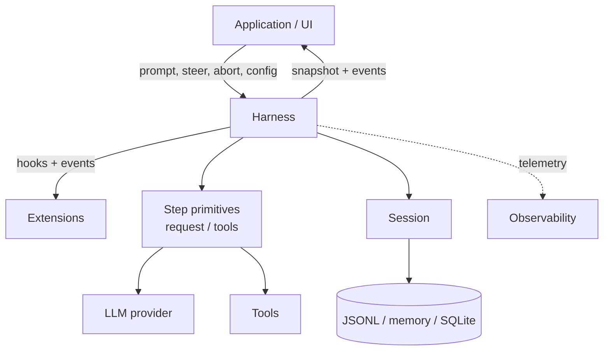
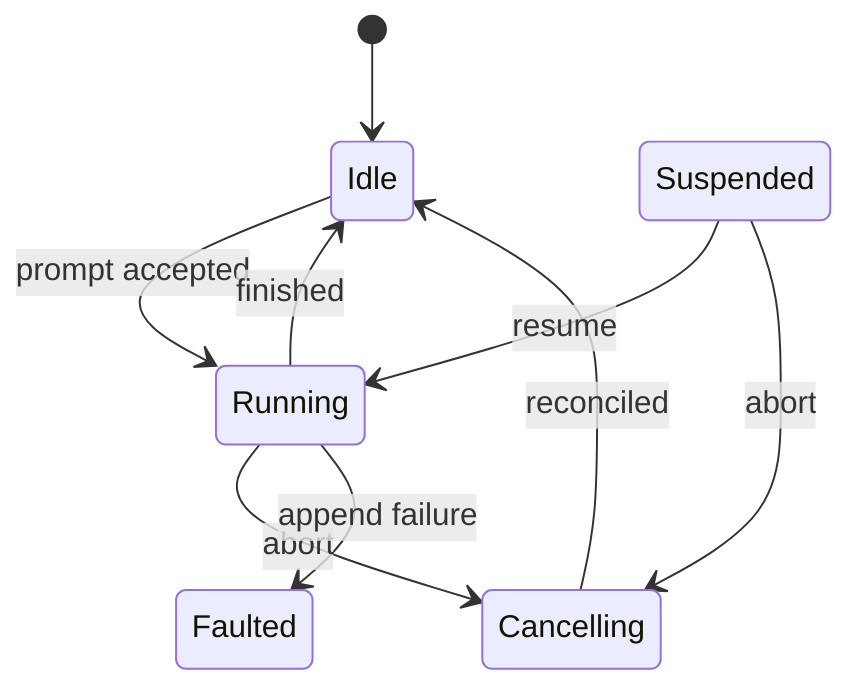
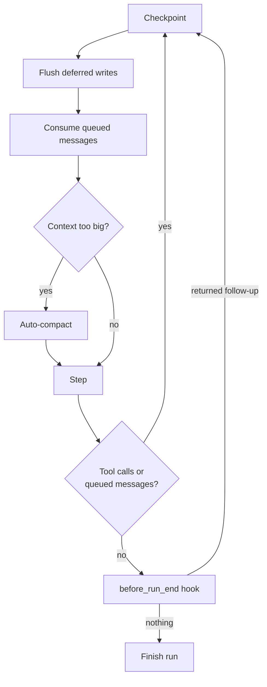
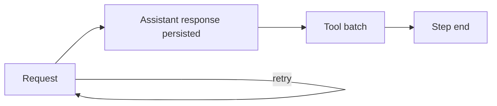
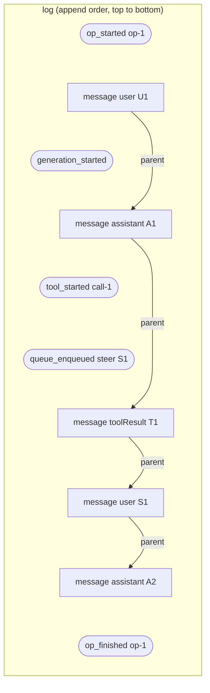
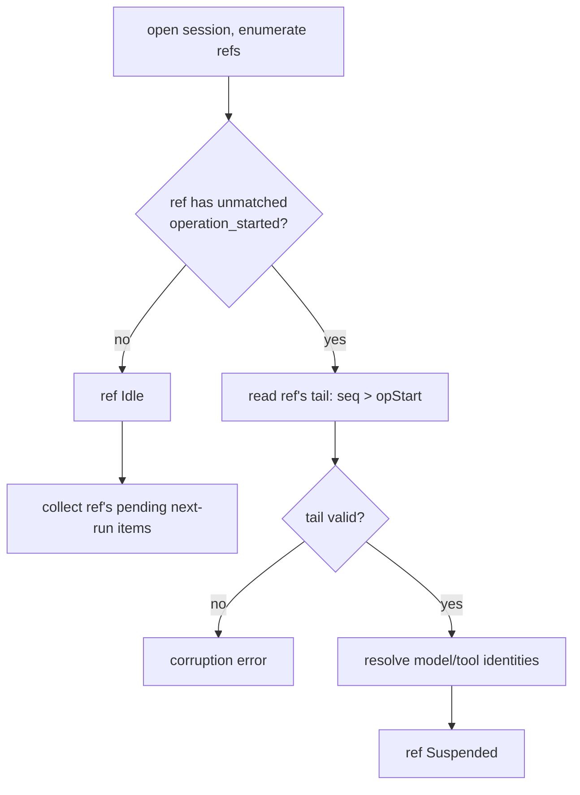

# Durable AgentHarness plan

## 1. Goals

- **Durable runs.** An accepted prompt is a durable operation. After a process crash, a new process restores the session and resumes the run from the last safe boundary. Every valid session prefix is a recoverable state.
- **Correct branch semantics.** Runs and queued messages are anchored to the branch they were accepted on. Navigation and compaction write multiple records; a crash between records must leave either a valid pre-operation state or one that recovery completes — never a half-moved cursor or a summary on the wrong branch.
- **Harness API.** Passive events to observe execution; awaited hooks to transform harness behavior (context, requests, tools, run boundaries). Extensions build on these.
- **Observability.** Everything is instrumentable — down to provider request/response internals — for logging and tracing (e.g. OTel), without going through the hook system.
- **UI model.** Atomic snapshot plus live event stream. No event replay; reconnect means new snapshot.
- **Single writer, parallel refs.** Exactly one harness writes a session at a time, enforced by the serving layer; restore treats impossible states from interleaved writers as corruption. Within that one writer, a session hosts one or more **refs** — named movable leaf pointers, each running at most one operation at a time, in parallel with its siblings (section 6). Interactive use never sees more than the default ref.
- **Old sessions load.** Existing session files open unchanged and restore as idle. Session entry types and tree semantics are unchanged.

## Non-goals

- **Exactly-once hook side effects.** What a hook hands to the harness (queue a message, append an entry) is durable once the call resolves and survives crashes. What a hook does on its own (HTTP calls, file writes) is invisible to the harness: after a crash it cannot know how far an interrupted handler got, so handlers are never re-run on resume. Hooks needing crash-safe external effects must be idempotent themselves, e.g. keyed by operation ID.
- **Provider stream resumption.** An interrupted provider request is retried or abandoned; partial streams are never persisted.

## 2. Terminology

The onion, outside in:

- **Harness** — executes runs against one session: drives provider requests and tools, manages queues, emits events, applies hooks. Exactly one harness writes a session at a time.
- **Session** — the durable state: an ordered, append-only log of entries. Two views over the same log: the tree (session entries, conversational state) and orchestration history (harness entries).
- **Session entry** — an entry in the session tree (`message`, `compaction`, `leaf`, ...). Defines conversational ancestry via `parentId`; visible in transcripts and model context.
- **Harness entry** — a private orchestration fact (operation started, tool started, ...) used to resume a run after abnormal termination. Lives in the same log, never in the tree: no parent, never the leaf, never in model context, never emitted publicly.
- **Ref** — a named, movable pointer to a leaf of the tree plus the work serialized on it: one active operation, its own queues, its persisted config derived from the path behind its leaf. Every session has the default ref `main`; embedders may create more (section 6).

Execution:

- **Operation** — a run, a manual compaction, or a tree navigation, executed on one ref. At most one operation is active per ref at any time; restore treats a log with two unmatched operation starts on the same ref as corruption.
- **Run** — one accepted prompt through all automatic continuations (tool calls, steering, follow-ups, auto-compaction) until the harness is idle again. Durable; may span process restarts.
- **Step** — one generation (plus retries), the resulting assistant response, and the complete tool batch it requested. A run is a sequence of steps.
- **Generation** — one billable cycle of producing a result (assistant response, compaction or branch summary); may span several physical provider requests. A step contains one or more generations (retries).
- **Checkpoint** — the safe point between steps where queued messages are consumed, deferred writes flush, and compaction is considered.
- **Deferred write** — a session write requested while a ref has a step in flight: hooks or the application appending a custom message, or changing model/thinking level/active tools. Applying it immediately would insert content before the in-flight request's tail — splitting an assistant tool-call message from its tool results, and violating the append-only context invariant (section 5) that keeps provider KV caches valid. So it is accepted durably on request and applied at the next checkpoint of that ref. While the ref is idle, the same writes apply immediately.
- **Resume** — continuing an unfinished run in a new process, possibly mid-step.

API:

- **Event** — a passive public observation. Cannot alter execution; not persisted or replayed.
- **Hook** — an awaited public interception point. Can transform or block execution.
- **Snapshot** — an atomic capture of current harness state, delivered race-free with every event after it (section 8).
- **Config** — model, thinking level, system prompt, active tools, resources. Getters return the latest accepted value. Setters while a step is in flight become deferred writes; the in-flight request and tool batch are not affected.

Central invariant:

> Session entries define what the conversation is. Harness entries define what the harness did, in what order. Log order determines orchestration history; `parentId` and per-ref leaf pointers determine branches; harness entries never alter tree topology.

## 3. Architecture



- **Step primitives** — the low-level building blocks split out of today's monolithic loop: one provider request, one tool batch, one step. Own no durable state; `runAgentLoop()` remains as a compatibility wrapper over them.
- **Harness** — the driver: accepts operations, sequences steps and checkpoints, owns queues, retry, compaction, navigation, cancellation, recovery. The only writer of harness entries.
- **Session** — owns the log and the tree view; validates and appends entries, answers branch/context queries.
- **Storage** — append + read for one session. No orchestration knowledge.

The public surface is harness methods, events, hooks, snapshots, config, session tree queries/writes, and the telemetry stream. Harness entries, their schemas, and recovery logic are private: nothing outside harness and storage reads or depends on them.

## 4. Run and step lifecycle

### Run states

States are per ref: each ref is independently Idle, Running, Cancelling, or Suspended. Faulted is the exception — an append failure faults the whole harness, every ref included, because none of them can record what it does.



- **prompt accepted** — the operation start is durable. Before that, a crash means the prompt never happened.
- **finished** — outcome `completed` or `failed`; the finish is durable, then the harness is idle.
- **abort** — cancellation is recorded durably, active effects are signalled, `abort()` returns. Reconciliation (tool results for unresolved calls, closing aborted assistant message) runs to completion in the background.
- **Suspended** — restore found an unfinished run. Nothing executes until `resume()`; `abort()` cancels without resuming execution.
- **Faulted** — a session append failed (disk full, I/O error). The harness stops all effects and rejects everything: it can no longer record what it does. The log is not corrupted, just a valid prefix, as after a crash. Fix the cause, reopen, restore: the run shows as Suspended. Log corruption is different: restore rejects it, no automatic path forward.

### Steps and checkpoints

A running operation alternates between steps and checkpoints:



A step:



- A step with tool calls always forces another checkpoint + step; the model must see its tool results answered.
- `steer()` and `followUp()` enqueue durably at any time during a run — acceptance appends a harness entry (tree-neutral, so mid-step is fine); the message itself becomes a session entry at its consumption point. Steering is injected at the next checkpoint, before the next request. Follow-ups are consumed only when tool continuation and steering are exhausted — when the model would otherwise stop.
- Auto-compaction is evaluated against the prospective context for the next request, after queued messages and deferred writes are applied.
- `before_run_end` runs when nothing is pending: no tool continuation, no queued messages. It may return or enqueue follow-ups, each durable on acceptance. The run finishes only when nothing is pending afterwards.

### Resume

Resume continues the existing run; it never starts a new one:

- Entry point is wherever the log ends: mid-step (retry the request, or reconcile an unfinished tool batch) or at a checkpoint.
- `before_run` ran when the prompt was accepted and is not called again; `before_resume` is.
- Pending queued messages and deferred writes accepted before the crash are still pending and apply normally.
- Per-request and per-tool hooks run for work actually performed after resume.

## 5. Session and the log

### One log, two views

A session is an append-only log. JSONL implements this literally (one JSON object per line); other backends may use tables and indices as long as ordering and semantics match. A record is either a **session entry** (tree) or a **harness entry** (orchestration). Log order is total; tree structure comes only from `parentId` on session entries.

Harness entries exist to resume a run after abnormal termination. They record accepted operations, issued provider requests, started tools, queued messages, and deferred writes, so a new process can tell how far execution got and continue without repeating effects. Nothing reads them during normal operation.



Rounded records are harness entries: no `parentId`, never the leaf, never in model context or transcripts, invisible through `SessionTree`. Rectangular records connected by `parent` arrows are session entries; the tree is that chain.

Consequences:

- Harness entries can be appended mid-step (steering, deferred-write acceptance) without touching tree ordering.
- Navigation, compaction, and forks (section 13) operate on the tree; orchestration facts are never hidden by a compaction barrier or copied into a fork.
- Old files contain no harness entries and restore idle.

### Durability rule

> Before an effect: append an intent entry naming what will happen and the ids it will produce. After the effect: append the result as a session entry with those ids.

No multi-record atomicity. Any log prefix is a valid state: an intent without its result means in flight or interrupted; recovery (section 12) decides completion per intent type.

### Append-only context

> Across the requests of a branch, provider context only ever grows at the tail. Inserting content before the previous request's tail invalidates the provider's KV cache from the insertion point onward — silently multiplying token cost.

This invariant, not just tool-call adjacency, is why mid-step writes defer to checkpoints: checkpoint application and queue consumption append at the tail, so the cached prefix survives every request. Compaction is the one deliberate exception — it trades a full cache invalidation for a smaller context, knowingly.

Two mechanisms carry mid-run content, with deliberately different contracts:

- **Queues** carry conversational intent: steer/followUp die on abort (payloads returned so a client can requeue), nextRun survives. The session entry lands at the consumption point — the position the model actually first saw it.
- **Deferred writes** carry facts: they survive abort and are applied even during cancellation reconciliation. Both are durable at acceptance.

Custom entries enter provider context only through registered projectors (`entryProjectors`: custom entry → context messages, evaluated at context build); without one they project to nothing and cannot affect the cache. Corollaries: projector output must be stable across context builds for entries already in context, and registering a projector later re-animates existing entries at their historical positions — a one-time cache break, the application's responsibility.

### Provisioned ids

Intent entries carry ids of session entries that do not exist yet: `tool_started.resultEntryId`, `queue_enqueued.target.id`, the operation start's initial message ids. The later session entry uses exactly that id. An intent is fulfilled iff an entry with its provisioned id exists; an id collision with different content is corruption.

```ts
/** A session entry payload with its id pre-allocated. parentId and timestamp
    are assigned when the entry is actually appended: it becomes a child of the
    then-current leaf, exactly like a normal append. */
type ProvisionedEntry<T extends SessionTreeEntry = SessionTreeEntry> = Omit<T, "parentId" | "timestamp">;
type ProvisionedMessage = ProvisionedEntry<MessageEntry>;
```

### Harness entry schemas

```ts
interface HarnessEntryBase {
  id: string;
  seq: number;            // position in the chronological log
  ref: string;            // the ref this record belongs to ("main" in a single-ref session)
  timestamp: string;
}
// Session entries carry no ref — the tree is shared between refs (common
// prefixes), so a ref field would fake ownership that does not exist. Which
// ref appended a session entry is derivable: a ref's operation appends a
// chain from its anchor, so membership is parentId linkage into that chain —
// one pass over the bounded tail, in seq order. Leaf records are the
// exception: they carry ref explicitly, they ARE the per-ref pointer.
// Old files: everything reads as "main".
// Entries that belong to an operation carry runId: the id of that operation's
// operation_started entry. Not on the base: queue_enqueued(nextRun) belongs to
// no operation — it targets the next run, and can be accepted while idle.

// The durable acceptance boundary for an operation. Everything decided
// before acceptance is persisted here: before_run output, queued next-run
// consumption, provisioned ids for structural results.
interface OperationStartedEntry extends HarnessEntryBase {
  type: "operation_started";
  sourceLeafId: string | null;      // the ref's leaf at acceptance
  intent:
    | {
        kind: "run";
        /** Prompt + before_run injections, full payloads with provisioned ids. */
        initialMessages: ProvisionedMessage[];
        /** Set iff before_run overrode the system prompt; fixed for the run.
            Absent: the systemPrompt config callback is evaluated per request
            (sees current active tools — mid-run tool changes rebuild the prompt). */
        systemPromptOverride?: string;
        resumeData?: Record<string, JsonValue>;   // per extension id
      }
    | {
        kind: "compaction";
        customInstructions?: string;
        resultEntryId: string;
      }
    | {
        kind: "navigation";
        targetId: string;
        destinationLeafId: string | null;
        summarize: boolean;
        customInstructions?: string;
        label?: string;
        summaryEntryId?: string;
        labelEntryId?: string;
        leafEntryId: string;
      };
}

// Cancellation is durable the moment abort() resolves. Clears this
// operation's steer/follow-up queue items; next-run items survive.
interface OperationCancelledEntry extends HarnessEntryBase {
  type: "operation_cancelled";
  runId: string;
  reason: "user" | "shutdown";
}

// Closes the operation. Cursor-neutral: cannot undo a navigation's leaf move.
// outcome "failed" is a durable, orderly failure: retry attempts exhausted,
// compaction/summary generation permanently failing, required model missing.
// outcome "cancelled" is a structural operation declined by its hook
// (before_compaction/before_navigation cancel). Either way the operation is
// closed; nothing resumes. Distinct from Faulted (section 4): a fault means
// appends fail, so no finish entry can be written and the operation restores
// as suspended instead.
interface OperationFinishedEntry extends HarnessEntryBase {
  type: "operation_finished";
  runId: string;
  outcome: "completed" | "aborted" | "failed" | "cancelled";
  error?: { code: string; message: string };   // safe fields only, no payloads
}

// Appended before each generation cycle the harness bills to a provider — an
// uncertainty marker ("a request may have gone out and been billed") and the
// durable crash-loop bound: attempt counts survive restarts. One entry per
// cycle, even when a cycle makes several physical requests (split-turn
// compaction runs two); recovery granularity is the result entry, so finer
// accounting buys nothing. Position and completion are positional: attempts
// after the newest session entry belong to the current request cycle, and a
// session entry committing closes the cycle. Validation: attempt numbers are
// consecutive within each gap between session entries (a gap is always
// single-purpose — compaction either commits its entry, closing the gap,
// or fails the run). All positional rules are per ref: "newest session
// entry" means the newest session entry chained by this ref's operation
// (parentId membership, see above) — the per-ref partition is what makes
// positional reduction safe under interleaved refs.
interface GenerationStartedEntry extends HarnessEntryBase {
  type: "generation_started";
  runId: string;
  purpose: "step" | "compaction" | "branch_summary";
  attempt: number;                  // 1-based within the current cycle
  model: { provider: string; modelId: string };
}

// Appended after before_tool and validation, before the effect starts.
// assistantEntryId + toolIndex is the durable invocation identity.
interface ToolStartedEntry extends HarnessEntryBase {
  type: "tool_started";
  runId: string;
  assistantEntryId: string;
  toolIndex: number;
  toolCallId: string;
  toolName: string;
  effectiveArgs: Record<string, unknown>;   // post-before_tool
  resultEntryId: string;                    // provisioned
  replay: "never" | "safe";
}

// steer()/followUp()/nextRun() acceptance. The message payload (any
// AgentMessage that converts to a user LLM message) travels here; the session
// entry appears at the consumption point. Steer/follow-up items resolve within
// their run. Next-run items are consumed by the next run-kind operation on the
// same ref, embedded in its operation_started initialMessages; compaction and
// navigation pass through without consuming. Pending items therefore always
// sit after the ref's last run-kind operation_started — recovery never scans
// further back.
interface QueueEnqueuedEntry extends HarnessEntryBase {
  type: "queue_enqueued";
  queue: "steer" | "followUp" | "nextRun";
  /** steer/followUp: their active run. Absent for nextRun — the item belongs
      to no operation until the next run consumes it. */
  runId?: string;
  target: ProvisionedMessage;
}

// SessionTree write or config setter accepted mid-step: message, custom entry,
// label, session name, or config change (model_change, ...). Applied in
// acceptance order at the next checkpoint — live or during recovery, each
// target is appended as a child of the then-current leaf; that is why
// ProvisionedEntry omits parentId.
interface WriteDeferredEntry extends HarnessEntryBase {
  type: "write_deferred";
  runId: string;
  target: ProvisionedEntry;   // full payload, provisioned id
}
```

Blocked, invalid, or truncation-failed tool calls append no `tool_started` — no external effect begins; they go straight to a synthetic error result.

### Log invariants

Restore rejects a log violating any of these as corrupt:

- at most one unmatched `operation_started` per ref
- operation events reference an existing operation of the same ref; finish/cancel never precede start
- attempt numbers are consecutive from 1 within each gap between session entries of the same ref
- tool invocation identities are unique; their assistant entries exist
- provisioned ids never collide with differing content
- a ref's active run cursor moves only through that run's appends

### SessionTree

`SessionTree` is new: the tree-facing contract over the log. `Session` implements it plus the log side below. Each ref exposes its own harness-owned `SessionTree` view (`ref.session`; `harness.session` is main's): branch-scoped reads default to that ref's leaf, appends chain to it, and writes defer while that ref has a step in flight — an immediate append would land before the in-flight request's tail, breaking tool-call adjacency and the append-only context invariant. Writes through one ref's view never defer because another ref is busy. Standalone `Session` writes apply immediately.

```ts
/** Filters and paging. Omit type to match every entry. */
interface EntryQuery {
  type?: SessionTreeEntry["type"];
  customType?: string;                     // for type: "custom"
  order?: "newestFirst" | "oldestFirst";   // default newestFirst
  limit?: number;
  cursor?: EntryCursor;                    // continue a previous page
}

/** Where a branch scan starts and stops. Defaults: the whole path, leaf to root. */
interface BranchBounds {
  /** Leaf end of the path. Default: the view's ref leaf. Needed to query another branch or an old compaction tail. */
  start?: string;
  /** Scan ends after the first matching entry, inclusive. */
  stopAtType?: SessionTreeEntry["type"];
  stopAtId?: string;
}

// Generic over metadata; finders return Extract<SessionTreeEntry, { type: T }>.
interface SessionTree<TMetadata extends SessionMetadata = SessionMetadata> {
  // Reads — always allowed
  getMetadata(): Promise<TMetadata>;
  getEntry(id: string): Promise<SessionTreeEntry | undefined>;
  getLeafId(): Promise<string | null>;
  getStats(): Promise<SessionStats>;

  // Global facts — latest-wins records outside the tree, not branch-scoped.
  // Setter naming is deliberate: "append" is reserved for tree writes.
  getName(): Promise<string | undefined>;
  setName(name: string): Promise<string>;
  getLabel(id: string): Promise<string | undefined>;
  setLabel(targetId: string, label: string | undefined): Promise<string>;

  /** Session-wide: all branches, log order. */
  findEntries(query?: EntryQuery): Promise<SessionTreeEntry[]>;

  /** Sugar: findEntries with limit 1. */
  findEntry(query?: Omit<EntryQuery, "limit" | "cursor">): Promise<SessionTreeEntry | undefined>;

  /** Branch-scoped: the path start (default leaf) → root. */
  findEntriesOnBranch(query?: EntryQuery & BranchBounds): Promise<SessionTreeEntry[]>;

  /** Sugar: findEntriesOnBranch with limit 1. */
  findEntryOnBranch(query?: Omit<EntryQuery, "limit" | "cursor"> & BranchBounds): Promise<SessionTreeEntry | undefined>;

  // Writes — immediate on standalone Session, deferred while a harness runs.
  // Resolve on durable acceptance; the returned string is the provisioned entry
  // id the session entry will carry when applied. Safe to call from hook and
  // event handlers at any point.
  appendMessage(message: AgentMessage): Promise<string>;   // includes custom app message types
  appendCustomEntry(customType: string, data?: unknown): Promise<string>;

  /** Writes accepted but not yet applied, in acceptance order. Empty on standalone Session. */
  getPendingWrites(): { id: string; entry: SessionTreeEntry }[];
}
```

Query semantics — a branch scan is: take the path from `start` (default: active leaf) to root, walk it in `order` direction, stop after a `stopAt` match (inclusive), filter, apply `limit`/`cursor`:

- `newestFirst` walks leaf→root: `stopAtType: "compaction"` ends at the **newest** compaction — the context window.
- `oldestFirst` walks root→leaf: the same query ends at the **oldest** compaction. The barrier is found in walk direction. For the newest-compaction segment in chronological order, fetch `newestFirst` and reverse; it is one context window, not a big list.
- `type`/`customType` filter results; a `stopAt` entry is returned only if it passes the filter.
- These subsume `getBranch()` and `getPathToRootOrCompaction()`: context build is `findEntriesOnBranch({ stopAtType: "compaction" })`; old-style compaction tails are a second call with `start: compaction.parentId, stopAtId: firstKeptEntryId`.
- Extension patterns: effective state = `findEntryOnBranch({ type: "custom", customType })`; branch collections = `findEntriesOnBranch({ type: "custom", customType })`; global inventory = `findEntries({ type: "custom", customType })`.
- `SessionTree` has no cursor mutation; tree navigation is `navigateTree()` on the harness.

> **Read consistency:** finders and `getEntry()` return committed entries only. A deferred write is not in the tree until applied; a handler that appends and immediately queries will not see its own write. A pending entry has no `parentId` yet, and any overlaid position would be a guess that later entries invalidate. Pending writes are visible via `getPendingWrites()` and the snapshot, correlated by provisioned id.

### Session API changes

`Session` implements `SessionTree` and gains the log side, used only by the harness and recovery:

```ts
class Session<TMetadata> implements SessionTree<TMetadata> {
  appendHarnessEntry(entry: HarnessEntryInput): Promise<HarnessEntry>;
  /** Full chronological log — session and harness entries interleaved. */
  getLog(options?: { afterSeq?: number; limit?: number }): Promise<LogRecord[]>;

  /** Typed harness-entry queries, same shape as the tree finders. SQLite
      serves them from an indexed harness-entry table. */
  findHarnessEntries(query?: { type?: HarnessEntry["type"]; ref?: string; runId?: string; afterSeq?: number; order?: "newestFirst" | "oldestFirst"; limit?: number }): Promise<HarnessEntry[]>;
  findHarnessEntry(query?): Promise<HarnessEntry | undefined>;   // limit 1
}
```

Restore reads are bounded regardless of session length, per ref: the ref's latest `operation_started`/`operation_finished` (index seek) locates its active operation, and everything else recovery needs — attempt counts, tool starts, pending queue items, deferred writes — lives at `seq` greater than that operation's start, filtered by ref (range scan). Pending next-run items cannot sit further back than the ref's last run-kind `operation_started` because run acceptance consumes them (see `QueueEnqueuedEntry`); SQLite stores ref and operation kind as columns, so locating them is an index seek.

Changes to the existing contract:

- `getPathToRootOrCompaction()` and `getBranch()` are removed — subsumed by `findEntriesOnBranch`. The duplicated walk logic in the JSONL and SQLite backends is deleted.
- `buildContext()` is reimplemented on the finders: one branch scan with `stopAtType: "compaction"`, plus the old-style tail scan (`start: compaction.parentId, stopAtId: firstKeptEntryId`) when the compaction entry predates embedded tails.
- Config derivation leaves `buildContext()`: model/thinking/active tools are point queries (`findEntryOnBranch`), correct across compaction barriers — and per ref, since each ref queries from its own leaf.
- Labels and session name are **de-treed**: `LabelEntry` and `SessionInfoEntry` records lose `parentId` and live outside the tree as global latest-wins facts (single writer makes log order a valid last-writer-wins order). They no longer appear in branch queries; old tree-entry forms convert on read. Fork handling: section 13.
- Leaf records gain `ref`; a session keeps one leaf pointer per ref (absent = `main`, which is how old files read).
- `custom_message` entries convert to custom agent messages on read; the entry type is retired from the write path.
- `getStorage()` is gone: raw storage is unreachable, all writes flow through `Session`, and `Session` is the single writer the log format assumes.
- JSONL becomes format v4: same file, same one-JSON-object-per-line, harness entries interleaved. v3 files load unchanged (zero harness entries, restore idle).

Storage backends implement append + read + the finder queries; they know nothing about operations, queues, or recovery (section 14).

## 6. Refs

A **ref** is a named, movable pointer to a leaf of the tree, plus the work serialized on it. It is what a git branch is — a name attached to a position, advanced by new work, movable to any point without rewriting history — fused with its worktree: at most one operation runs on a ref at a time, exactly as git refuses to check the same branch out into two worktrees. One intuition git users must extend: navigation can move a ref to *any* entry (like `git reset`), not only forward.

```text
tree (shared, append-only)              refs
a ── b ── c ── d                        main → d
      └── e ── f                        slack:1719432.0021 → f
```

- Every session has the default ref **`main`**. `AgentHarness` implements the ref surface directly (section 7): `harness.prompt(...)` *is* main's prompt. Interactive pi never creates a second ref — one active branch, resume-where-you-left-off, `/tree` — nothing about that model changes.
- Embedders create refs keyed by external identities: Slack channel = session + `main`, each thread = a ref anchored at the pinged entry; each email thread = a ref. The platform's UI is the ref picker; no client browses refs abstractly, and end users never see the word.
- Each ref owns: its leaf; one active operation; its steer/followUp/nextRun queues; its pending deferred writes; and its persisted config view — model, thinking level, and active tools are point queries on the path behind its leaf, so two refs run different models without knowing of each other. Harness-global stay: tool implementations, resources, stream options, retry policy — registries and runtime capabilities are shared, activation is per-ref and branch-anchored.
- Refs are pointers, not containers. Deleting one removes the name, never entries. Two refs at the same entry diverge on their next append. `navigateTree` moves one ref.
- Refs run in parallel under one harness: one writer, one log, interleaved records partitioned by `ref`. Cross-process concurrency stays out of scope — all traffic for a session routes to the process holding its harness.
- After a crash, every ref with an unfinished operation restores suspended, independently; `create()` returns them all (section 7).

**Why refs are not trees.** Harness entries carry `ref` but no parent pointers, deliberately. Within one ref, operations are serialized and there is one writer — so for records filtered by ref, log order *is* causal order. A parent pointer would repeat what `ref` + append order already say, and add validation surface (parent exists, chain does not fork, chain belongs to the operation) with no consumer. Parenting earns its keep only when order stops being reliable: concurrent writers to the *same* ref (excluded by design) or replication without a total order (section 17).

## 7. Public API

```ts
const { harness, suspended } = await AgentHarness.create({ session, models, model, ... });

for (const s of suspended) {
  await harness.ref(s.ref)!.resume();   // or .abort(); interactive pi: 0 or 1, always "main"
}
await harness.prompt("...");
```

The existing surface stays. New: `create()` replaces the constructor, `resume()` continues a suspended operation, `watch()` provides snapshots (section 8), `hooks`/`events` replace `on()`/`subscribe()` (sections 9, 10) — and the operation surface is factored into `AgentRef`, which `AgentHarness` implements for `main`. There is one operation surface, defined once.

```ts
interface AgentHarnessOptions {
  session: Session;
  /** Provider collection for all requests: steps, compaction, branch summaries. */
  models: Models;
  /** model, thinkingLevel, activeToolNames: initial values only. If a ref's
      branch has persisted config entries, the session wins; these apply to fresh
      sessions and refs without config history. An unresolvable persisted model
      surfaces in suspended[].missing / falls back with a warning, mirroring the
      old coding agent. */
  model: Model<any>;
  thinkingLevel?: ThinkingLevel;
  tools?: TTool[];
  activeToolNames?: string[];
  toolContext?: TContext | (() => TContext | Promise<TContext>);
  systemPrompt?: AgentHarnessSystemPrompt;
  resources?: AgentHarnessResources;
  /** Curated provider request options (transport, headers, timeouts, provider-internal retries). Snapshotted at request start. */
  streamOptions?: AgentHarnessStreamOptions;
  /** Harness-level retry for failed requests (steps, compaction, branch summaries). Attempt counts are durable; a restart never resets them. */
  retry?: RetryPolicy;
  compaction?: CompactionSettings;   // enabled, reserveTokens, keepRecentTokens
  steeringMode?: QueueMode;
  followUpMode?: QueueMode;
  /** Converts AgentMessages (including app custom types via CustomAgentMessages)
      to provider messages before each request. Default: exported
      defaultConvertToLlm, handling bashExecution, custom, branchSummary,
      compactionSummary; standard messages pass through. Also used at
      prompt/queue acceptance to validate that a submitted AgentMessage
      converts to a user message. Reordering/pruning is not its job; that is
      transform_context. */
  convertToLlm?: (messages: AgentMessage[]) => Message[] | Promise<Message[]>;
}

/** The operation surface of one ref. AgentHarness implements it for main;
    harness.ref(name) returns the same surface for any other ref. */
interface AgentRef {
  readonly name: string;              // "main" on the harness itself
  getLeafId(): Promise<string | null>;

  // Operations. Never throw — they resolve with a result value in every case
  // (see "Results, not exceptions" below). Message forms mirror Agent: any
  // AgentMessage accepted here (and by the queues) must convert to a user LLM
  // message via convertToLlm; validated at acceptance. At most one operation
  // is active per ref; operations on different refs run concurrently.
  prompt(text: string, images?: ImageContent[]): Promise<RunResult>;
  prompt(message: AgentMessage | AgentMessage[]): Promise<RunResult>;   // e.g. sendMessage triggerTurn
  skill(name: string, additionalInstructions?: string): Promise<RunResult>;
  promptFromTemplate(name: string, args?: string[]): Promise<RunResult>;
  compact(options?: { customInstructions?: string; settings?: Partial<CompactionSettings> }): Promise<CompactionRunResult>;
  navigateTree(targetId: string, options?: NavigateTreeOptions): Promise<NavigationRunResult>;

  /** New. Continue this ref's suspended operation to its durable end. */
  resume(): Promise<ResumeResult>;

  /** Existing. Now durable: cancellation is recorded before effects are signalled; returns without waiting for reconciliation. No-op while this ref is idle. */
  abort(): Promise<AbortResult>;

  // Queues (existing) — now durable on resolve, and per ref (nextRun included:
  // consumed by this ref's next run). Payloads are AgentMessage: user messages
  // and custom extension messages (sendMessage deliverAs). As with prompt(),
  // every AgentMessage must convert to a user LLM message via convertToLlm;
  // validated at acceptance.
  steer(text: string, images?: ImageContent[]): Promise<QueueResult>;     // requires active run
  steer(message: AgentMessage): Promise<QueueResult>;
  followUp(text: string, images?: ImageContent[]): Promise<QueueResult>;  // requires active run
  followUp(message: AgentMessage): Promise<QueueResult>;
  nextRun(text: string, images?: ImageContent[]): Promise<QueueResult>;   // any time; was nextTurn()
  nextRun(message: AgentMessage): Promise<QueueResult>;

  // Idle coordination — this ref's idleness.
  waitForIdle(): Promise<void>;              // existing
  runWhenIdle(callback): Promise<void>;      // new; runtime-only, not durable

  // Persisted, branch-anchored config — per ref by construction: session
  // entries on the path behind this ref's leaf, restored by point queries.
  // Setters mid-step become deferred writes on this ref.
  getModel() / setModel(model)
  getThinkingLevel() / setThinkingLevel(level)
  getActiveTools() / setActiveTools(toolNames)    // unknown names reject

  /** This ref's SessionTree view (section 5): branch reads default to this
      ref's leaf, appends chain to it, writes defer while this ref runs.
      Replaces appendMessage(). */
  session: SessionTree;

  /** Scoped: this ref's transcript, run state, queues, and events (section 8). */
  watch(): Promise<{ snapshot: RefSnapshot, start, unsubscribe }>;
}

class AgentHarness implements AgentRef {
  /** Opens the session log, restores state, starts no effects. Replaces the
      constructor. One suspended entry per ref with an unfinished operation. */
  static create(options: AgentHarnessOptions): Promise<{
    harness: AgentHarness;
    suspended: SuspendedOperation[];
  }>;

  // Ref management. Names are app-chosen keys ("slack:1719432.0021").
  ref(name: string): AgentRef | undefined;             // lookup, never creates
  createRef(name: string, at: string | null): Promise<RefResult>;   // anchor at an entry or root
  deleteRef(name: string): Promise<RefResult>;         // pointer only; rejected while its
                                                       // operation is active or suspended;
                                                       // "main" cannot be deleted
  refs(): RefInfo[];

  // Harness-global config — registries and runtime capabilities, shared by
  // all refs. Tool implementations are code and cannot persist; the active
  // set (names) is what persists, per ref.
  getTools() / setTools(tools, activeToolNames?)  // registry; active set applies to main
  getResources() / setResources(resources)
  getStreamOptions() / setStreamOptions(streamOptions)
  getRetryPolicy() / setRetryPolicy(policy)            // new
  getCompactionSettings() / setCompactionSettings(s)   // new
  getSteeringMode() / setSteeringMode(mode)
  getFollowUpMode() / setFollowUpMode(mode)

  /** Session-wide observer: refs inventory snapshot plus the unfiltered event
      stream (section 9). No transcripts — compose with ref.watch() per ref. */
  watchSession(): Promise<{ snapshot: SessionSnapshot, start, unsubscribe }>;

  // Harness-global; every hook/event payload carries ref (sections 9, 10).
  hooks: ...;
  events: ...;

  /** New. Detach cleanly — see semantics below. Does not abort operations; they stay resumable. */
  close(): Promise<void>;
}

interface RefInfo {
  name: string;
  leafId: string | null;
  run: null | { id: string; kind: "run" | "compaction" | "navigation";
                status: "running" | "suspended" | "cancelling" };
}

type RefResult = { ok: true; ref: AgentRef } | { ok: false; outcome: "rejected"; error: ErrorInfo };

interface SuspendedOperation {
  ref: string;
  kind: "run" | "compaction" | "navigation";
  id: string;
  startedAt: string;
  /** For runs: original prompt content (text and images), for display. */
  prompt?: (TextContent | ImageContent)[];
  /** The operation was cancelled pre-crash; resume() completes the abort. Undelivered
      steer/follow-up payloads are returned here — the crash-path equivalent of
      AbortResult — so a client can offer to requeue them. */
  cancelled?: { clearedSteer: AgentMessage[]; clearedFollowUp: AgentMessage[] };
  /** Identities the log references that current config cannot resolve. Non-empty: resume() resolves rejected. */
  missing: { tools: string[]; models: string[] };
}
```

### Results, not exceptions

Operation and queue methods never throw. Every call resolves with a result; a promise rejection is a bug, not an outcome. The invariant: a **durable outcome** corresponds exactly to an `operation_started`…`operation_finished` pair in the log (with matching events); `rejected` corresponds to a log that was not written; `faulted` to a log that can no longer be written.

Result shape: `ok: true` carries the goods and nothing else; `ok: false` is a discriminated union of everything that went differently. Typical caller code is one check; code that cares switches on `outcome`.

```ts
interface ErrorInfo { code: string; message: string }

/** Failures shared by all methods. */
type Failure =
  | { ok: false; outcome: "rejected"; error: ErrorInfo }
    // the call never became an operation — no runId exists anywhere, the log is untouched
  | { ok: false; outcome: "faulted"; runId?: string; error: ErrorInfo };
    // appends stopped working. runId present: the operation started and restores as
    // suspended after reopening. absent: the fault hit the acceptance append itself.

// finalMessage is defined via the entry→message projection: the run's newest
// message entry that projects to an AssistantMessage. Custom entries project to
// nothing and custom messages project to user messages, so neither can be
// finalMessage by construction. Full transcript content is not duplicated in
// results — it is in the session (branch query scoped to the run) and was
// delivered via events.
type RunResult =
  | { ok: true; runId: string; finalMessage: AssistantMessage }
  | { ok: false; outcome: "aborted"; runId: string; finalMessage: AssistantMessage }  // the aborted closure
  | { ok: false; outcome: "failed";  runId: string; error: ErrorInfo; finalMessage?: AssistantMessage }
    // finalMessage absent when the run failed before any assistant response (e.g. auto-compaction)
  | Failure;

type CompactionRunResult =
  | { ok: true; runId: string; entry: CompactionEntry }
  | { ok: false; outcome: "cancelled" | "aborted"; runId: string }  // hook declined / user abort
  | { ok: false; outcome: "failed"; runId: string; error: ErrorInfo }
  | Failure;

type NavigationRunResult =
  | { ok: true; runId: string; newLeafId: string | null; summaryEntry?: BranchSummaryEntry }
  | { ok: false; outcome: "cancelled" | "aborted"; runId: string }
  | { ok: false; outcome: "failed"; runId: string; error: ErrorInfo }
  | Failure;

type QueueResult =
  | { ok: true }           // durably accepted in the log
  | Failure;

// Runs can never be "cancelled" (no hook vetoes an accepted run);
// kind discriminates which result shape applies.
type ResumeResult =
  | ({ kind: "run" } & RunResult)
  | ({ kind: "compaction" } & CompactionRunResult)
  | ({ kind: "navigation" } & NavigationRunResult);
```

```ts
const result = await harness.prompt("...");
if (!result.ok) {
  showError(result);          // switch on result.outcome for finer handling
  return;
}
render(result.finalMessage);
```

Rejection reasons (`error.code`): `busy` (this ref), `suspended_pending`, `no_active_run` (steer/follow-up while the ref is idle), `nothing_to_resume`, `missing_identities` (resume with `missing`), `invalid_message` (does not convert to a user message), `unknown_skill`, `unknown_template`, `unknown_target`, `unknown_ref`, `ref_exists`, `invalid_ref` (createRef with unknown anchor or reserved name), `nothing_to_compact`, `closed`, `faulted` (harness already faulted when called).

Why rejections are not `outcome: "failed"`: `failed` is a durable fact — the run happened, may have cost money, and its end is recorded. A rejection is the absence of any fact: no runId that appears anywhere, no events, nothing to resume. Callers also handle them differently — rejected means fix the call or wait; failed means the run is over, show the error. Faults are neither: the operation may still be resumable after the underlying cause is fixed, so claiming a terminal outcome would lie about the log.

Semantics not visible in the signatures:

- `prompt()`/`skill()`/`promptFromTemplate()` resolve when the run reaches its durable end; `finalMessage` carries the answer when one exists. A failed auto-compaction or exhausted retries resolve `outcome: "failed"` — no assistant message is fabricated for the return value (the transcript still gets an error assistant message where one naturally belongs, i.e. failed provider steps and aborts). Operations resolve `rejected` while the same ref has an operation active or suspended — a suspended operation must be resumed or aborted first, explicitly. Other refs are unaffected.
- `steer()`/`followUp()`/`nextRun()` resolve when the message is durably accepted, not when consumed. Consumption rules live with `QueueEnqueuedEntry` (section 5): steer/follow-up resolve within their run; next-run items are consumed by the same ref's next run, prepended to its initial messages. Once a run start exists, its initial messages are guaranteed to be appended — by recovery if necessary, even if the run is then cancelled — so accepted content is never silently dropped. A client that prefers to hold material itself can compose `prompt(messages[])` instead.
- Bash executions are not queue items: `!cmd` and `!!cmd` results are transcript appends via `session.appendMessage()` — immediate while idle, deferred writes mid-run. Both are persisted and displayed; `!!` sets `excludeFromContext`, and the default `convertToLlm` drops it from provider context.
- Persisted config (model, thinking level, active tools) is restored via branch point queries — `findEntryOnBranch("model_change")` etc. Compaction truncates message context, not config history: config entries behind a compaction barrier still count. (Today's `buildContext` loses them on reload; the old coding-agent got this right via full-path replay.)
- `abort()` on a suspended operation records the cancellation and reconciles without executing further provider or tool work.
- Retry lives in two layers: `streamOptions.maxRetries` covers provider-internal transport retries inside one request; `retry: RetryPolicy` is the harness policy across failed requests, with durable attempt counts.
- Deferred writes through `harness.session` apply in acceptance order at the next checkpoint. Both moments are observable and correlated by the provisioned entry id: acceptance fires a pending-write event (config getters also update immediately) and pending writes appear in the snapshot; application fires the normal entry events at the checkpoint with the same id (section 9). The raw storage is not reachable from the harness; writing to it directly while a harness is live is a contract violation.
- All calls on an already-faulted harness resolve `{ ok: false, outcome: "rejected", error: { code: "faulted" } }` — rejected, not faulted: the call itself never started anything.
- `close()`: rejects all further calls, signals in-flight provider/tool effects (no durable cancellation is recorded), waits for the append in progress to settle, discards late effect results, and releases the writer claim. An active run restores as suspended, same as after a crash; the log needs no shutdown record.
- One live `AgentHarness` per session; `create()` on a session with a live harness is a serving-layer error (SQLite rejects it, JSONL cannot detect it).

## 8. Snapshots and subscription

A UI needs current state plus every change after it, gap-free. That includes the transport gap: a server proxying a harness must get the snapshot to its client before any event reaches the wire. `watch()` buffers until the consumer arms delivery:

```ts
const { snapshot, start, unsubscribe } = await ref.watch();   // harness.watch() = main's

await send(client, { kind: "snapshot", snapshot });      // snapshot is on the wire
start((event) => send(client, event));                   // flush buffer in order, then go live
```

`watch()` captures the snapshot and starts buffering atomically. `start(listener)` flushes the buffered events in order and switches to live delivery. Each event is delivered exactly once, in order — no sequence numbers, no registration race. `unsubscribe()` (before or after `start()`) drops the subscription and any buffer.

`watch()` is **ref-scoped**: this ref's transcript, run state, queues, pending writes, and only this ref's events. A Slack-thread renderer sees its thread and nothing else; sibling refs are invisible (no refs inventory in a `RefSnapshot`). The session-wide observer is `harness.watchSession()`: its snapshot is the refs inventory — `RefInfo` per ref plus suspended details — with no transcripts, and its stream is the unfiltered firehose. A dashboard composes: `watchSession()` for the overview, `ref.watch()` per opened thread.

```ts
interface RefSnapshot {
  ref: string;
  // Transcript: this ref's branch, oldest first (the context window plus
  // its compaction entry; UIs page further history via session queries)
  transcript: SessionTreeEntry[];
  leafId: string | null;

  run: null | {
    id: string;
    kind: "run" | "compaction" | "navigation";
    status: "running" | "suspended" | "cancelling";
    startedAt: string;
    /** status "suspended" only: what a client needs to offer resume/abort.
        Same data create() returned — duplicated here because a remote UI
        only ever sees the snapshot, not create()'s return value. */
    suspended?: {
      prompt?: (TextContent | ImageContent)[];
      missing: { tools: string[]; models: string[] };
      cancelled?: { clearedSteer: AgentMessage[]; clearedFollowUp: AgentMessage[] };
    };
    /** Live progress, when mid-step. */
    streamingMessage?: AssistantMessage;
    runningTools: {
      /** Unique within the current tool batch; correlates with the tool-call block in the newest assistant message. */
      toolCallId: string;
      toolName: string;
      args: unknown;
      /** Latest streamed partial result, when the tool reports updates. */
      partialResult?: AgentToolResult<unknown>;
    }[];
    retry?: { attempt: number; maxAttempts: number; nextAttemptAt: string };
  };

  queues: { steer: AgentMessage[]; followUp: AgentMessage[]; nextRun: AgentMessage[] };
  pendingWrites: { id: string; entry: SessionTreeEntry }[];

  faulted: boolean;   // harness-wide; mirrored into every ref snapshot
}

interface SessionSnapshot {
  refs: (RefInfo & {
    suspended?: SuspendedOperation;   // resume/abort offer data, per ref
  })[];
  faulted: boolean;
}
```

- Config (model, thinking level, active tools, resources, stream options) is not in the snapshot — getters are always current, and config events (section 9) tell the UI when to re-read. One source of truth.
- `streamingMessage` and `runningTools` let a UI attaching mid-step render immediately: the partial assistant message and each running tool's latest partial result, the state it would have accumulated from `message_update`/`tool_update` events.
- A `suspended` run in the snapshot is the UI's cue to offer resume/abort.
- Reconnect means calling `watch()` again. Against a living harness the new snapshot includes current live progress. Only process death loses it: a restored harness has no partial streams or running tools to report, and the snapshot shows the suspended run instead; the durable transcript is complete regardless. Surviving transport drops is the serving layer's job.
- A ref watcher receives the full event vocabulary of section 9, filtered to its ref; `watchSession()` and `harness.events.on(type, ...)` receive everything, unfiltered. `events.on` is live-only: no snapshot, no buffering.
- Watchers are independent, each with its own buffer and `start()` gate.
- A watcher that never calls `start()` buffers unboundedly; call `unsubscribe()` when abandoning one.

## 9. Events

One flat stream, shared by `harness.events.on(type, listener)` and `watch()`.

Guarantees:

- Passive: events cannot alter execution. A thrown listener exception (`watch()` or `events.on`) is caught and reported as a `handler_error` event plus telemetry — same channel as hook handler errors (section 10), never stdio. A listener that throws while handling a `handler_error` event is reported to telemetry only; the event is not re-emitted.
- Ordered: delivery follows process order, identically for streams and push listeners.
- Not persisted, not replayed; reconnect means a new `watch()`.
- Events reporting durable facts (`message_end`, `entry_added`, `run_end`, ...) fire only after the fact is committed; what an event announces is already queryable.
- Events report final effective values, after hook transformation.
- Event payloads are JSON-serializable and secret-free, so a server can proxy them to clients verbatim. Live objects (models, tools, resources, stream options) are referenced by name/id, never embedded.
- Every event carries `ref: string` — bluntly, all of them; omitted from the catalog listings for brevity. Every operational event additionally carries `runId`; step-scoped events carry `stepId`; recovered work carries `recovery: true`.

### Catalog

Derived from the existing `AgentEvent`, `AgentHarnessOwnEvent`, and coding-agent `AgentSessionEvent` vocabularies. Mutation hooks (`before_agent_start`, `context`, `tool_call`, ...) are not events anymore — they move to section 10. Fields shown without comment keep their existing meaning.

```ts
// Run lifecycle -----------------------------------------------------------

interface RunStartEvent {
  type: "run_start";            // was: agent_start
  runId: string;
}

interface RunResumeEvent {
  type: "run_resume";           // new
  runId: string;
}

interface RunCancelEvent {
  type: "run_cancel";           // was: abort
  runId: string;
  clearedSteer: AgentMessage[];
  clearedFollowUp: AgentMessage[];
}

interface RunEndEvent {
  type: "run_end";              // was: agent_end + settled
  runId: string;
  outcome: "completed" | "aborted" | "failed";
  /** Same definition as RunResult.finalMessage. Transcript deltas were
      already delivered via message/entry events; agent_end.messages is gone. */
  finalMessage?: AssistantMessage;
  error?: ErrorInfo;
}

interface FaultEvent {
  type: "fault";                // new
  code: string;
  message: string;
}

// was: coding-agent ExtensionError via onError. One channel for all
// extension-code failures — hook handlers and event listeners (section 10).
type HandlerErrorEvent = {
  type: "handler_error";
  runId?: string;
  error: string;
  stack?: string;
} & (
  | { kind: "hook"; hook: string }        // hook type
  | { kind: "event"; event: string }      // event type being delivered
);

// Step and retry ----------------------------------------------------------

interface StepStartEvent {
  type: "step_start";           // was: turn_start
  runId: string;
  stepId: string;
}

interface StepEndEvent {
  type: "step_end";             // was: turn_end (also the save-point moment)
  runId: string;
  stepId: string;
  message: AssistantMessage;
  toolResults: ToolResultMessage[];
}

// Retry — unifies harness retry_scheduled/retry_attempt_start/retry_finished
// and coding-agent auto_retry_* / summarization_retry_*. Normal requests emit
// nothing: the UI's busy state spans run_start..run_end (or the
// compaction/navigation brackets). Retry events only surface the exception.

interface RetryScheduledEvent {
  type: "retry_scheduled";      // a request failed, next attempt is pending
  runId: string;
  purpose: "step" | "compaction" | "branch_summary";
  attempt: number;
  maxAttempts: number;
  delayMs: number;
  errorMessage: string;
}

interface RetryStartEvent {
  type: "retry_start";          // the scheduled attempt begins
  runId: string;
  purpose: "step" | "compaction" | "branch_summary";
  attempt: number;
}

interface RetryEndEvent {
  type: "retry_end";            // retrying resolved: success, or final failure
  runId: string;
  purpose: "step" | "compaction" | "branch_summary";
  attempt: number;
  success: boolean;
  finalError?: string;
}

// Messages and tools ------------------------------------------------------

interface MessageStartEvent {
  type: "message_start";
  runId?: string;               // absent for idle SessionTree writes
  message: AgentMessage;
}

interface MessageUpdateEvent {
  type: "message_update";       // only emitted for assistant messages during streaming, as today.
  runId: string;                // AssistantMessageEvent already carries the partial message and
  message: AgentMessage;        // per-block deltas; we add nothing on top.
  assistantMessageEvent: AssistantMessageEvent;
}

interface MessageEndEvent {
  type: "message_end";
  runId?: string;
  message: AgentMessage;
  entryId: string;              // new: the committed session entry
}

interface ToolStartEvent {
  type: "tool_start";           // was: tool_execution_start
  runId: string;
  stepId: string;
  toolCallId: string;
  toolName: string;
  args: unknown;                // effective args, after before_tool
}

interface ToolUpdateEvent {
  type: "tool_update";          // was: tool_execution_update
  runId: string;
  stepId: string;
  toolCallId: string;
  toolName: string;
  partialResult: AgentToolResult<unknown>;
}

interface ToolEndEvent {
  type: "tool_end";             // was: tool_execution_end
  runId: string;
  stepId: string;
  toolCallId: string;
  toolName: string;
  result: AgentToolResult<unknown>;
  isError: boolean;
}

// Session and config ------------------------------------------------------

interface EntryAddedEvent {
  type: "entry_added";          // generalizes coding-agent entry_appended
  entry: SessionTreeEntry;      // non-message entries: custom, label, name, config, compaction, summary
}

interface WritePendingEvent {
  type: "write_pending";        // new — deferred write durably accepted
  runId: string;
  entryId: string;              // provisioned id; entry_added/message_end follows with the same id
  entry: SessionTreeEntry;
}

interface QueueUpdateEvent {
  type: "queue_update";         // per ref — like every event it carries ref;
  steer: AgentMessage[];        // these are that ref's queues
  followUp: AgentMessage[];
  nextRun: AgentMessage[];
}

// Payloads identify the change compactly; clients needing full objects use the
// getters (locally or via their server). streamOptions carries no value: headers
// may hold secrets, transport may be a function.
type ConfigUpdateEvent = {
  type: "config_update";        // was: model_update, thinking_level_update, tools_update, resources_update
} & (
  | { property: "model"; value: { provider: string; modelId: string }; previous: { provider: string; modelId: string } | null }
  | { property: "thinkingLevel"; value: ThinkingLevel; previous: ThinkingLevel }
  | { property: "activeTools"; value: string[]; previous: string[] }
  | { property: "tools"; value: string[]; previous: string[] }          // names
  | { property: "resources"; value: { skills: string[]; promptTemplates: string[] } }  // names
  | { property: "streamOptions" }
  | { property: "retryPolicy"; value: RetryPolicy }
  | { property: "compactionSettings"; value: CompactionSettings }
  | { property: "steeringMode"; value: QueueMode }
  | { property: "followUpMode"; value: QueueMode }
);

// Compaction and navigation ----------------------------------------------

interface CompactionStartEvent {
  type: "compaction_start";     // from coding-agent compaction_start
  runId: string;                // the run for auto, the operation for manual
  reason: "manual" | "threshold" | "overflow";
}

// End events mirror operation_finished.outcome and the result types — one
// vocabulary across log, results, and events.
interface CompactionEndEvent {
  type: "compaction_end";       // was: session_compact + coding-agent compaction_end
  runId: string;
  reason: "manual" | "threshold" | "overflow";
  outcome: "completed" | "cancelled" | "aborted" | "failed";
  entry?: CompactionEntry;      // outcome "completed"
  fromHook: boolean;
  error?: ErrorInfo;            // outcome "failed"
}

interface NavigationStartEvent {
  type: "navigation_start";     // new — operation accepted, summary may generate
  runId: string;                // the navigation operation
  targetId: string;
}

interface NavigationEndEvent {
  type: "navigation_end";       // was: session_tree — the leaf moves atomically here;
  runId: string;                // navigateTree() is the only cursor mutation
  outcome: "completed" | "cancelled" | "aborted" | "failed";
  oldLeafId: string | null;
  newLeafId: string | null;
  summaryEntry?: BranchSummaryEntry;   // outcome "completed", when summarize
  error?: ErrorInfo;                   // outcome "failed"
}
```

### Nesting

Start/end pairs bracket their operation; request, message, and tool events happen between them. What a consumer sees:

```text
run_start
  step_start
    message_start
    message_update*
    message_end          assistant committed
    tool_start / tool_update* / tool_end     per tool call
    message_end          toolResult committed, source order
  step_end
  compaction_start       auto-compaction at a checkpoint, when needed
    entry_added          compaction entry committed
  compaction_end
  step_start ... step_end                    until no continuation
run_end
```

A UI's busy indicator spans the brackets: `run_start`..`run_end`, and for standalone operations `compaction_start`..`compaction_end` / `navigation_start`..`navigation_end`:

```text
compaction_start         reason: manual        navigation_start
  entry_added            compaction entry        entry_added        summary entry
compaction_end                                  navigation_end       leaf moves here
```

A failed request inside any bracket emits `retry_scheduled`, then `retry_start` for the next attempt, then `retry_end` when retrying resolves — success or final failure. Requests that succeed first try emit no request-level events at all.

All events additionally carry `recovery?: true` when emitted for recovered work.

### Notes

- Every message entering the session fires message events, regardless of source: agent loop, queues, `SessionTree` writes. `message_end` means committed, final content, usage known; UIs drop their streaming buffer on it. ToolResult messages get `message_start`/`message_end` in source order after `tool_end`.
- Messages get message events; every other entry gets `entry_added`. Both fire only after durable persistence. No entry commits without exactly one of the two firing.
- `runId`/`stepId` on message/tool events exist for correlation (telemetry spans, server-side log processing). A single-harness UI can ignore them; there is only one active run.
- `run_cancel` fires when cancellation is accepted; `run_end` (outcome `aborted`) fires after reconciliation completes. Between them the snapshot shows `status: "cancelling"`.
- Provider request internals (status, headers, payloads, timings) are not events; they belong to the observability channel and the `after_response` hook.

### Old vs. new

| old (loop / harness / coding-agent) | new |
|---|---|
| `agent_start` | `run_start` |
| `agent_end` | `run_end` (`outcome`, `error`, `finalMessage`; `agent_end.messages` dropped — deltas via message/entry events) |
| `settled` | `run_end` (settlement is part of finishing) |
| `abort` | `run_cancel` |
| `turn_start` / `turn_end` | `step_start` / `step_end` |
| `save_point` | dropped — internal; deferred-write application is visible via `entry_added`/`message_end` |
| `message_start` / `message_update` / `message_end` | same names and payloads; `message_end` gains `entryId` |
| `tool_execution_start` / `_update` / `_end` | `tool_start` / `tool_update` / `tool_end` |
| `after_provider_response` | dropped as event — `after_response` hook (section 10) and observability |
| `retry_scheduled`, `retry_attempt_start`, `retry_finished` (+ coding-agent `auto_retry_*`, `summarization_retry_*`) | `retry_scheduled` / `retry_start` / `retry_end`, unified via `purpose` |
| `queue_update` | `queue_update` (`nextTurn` field renamed `nextRun`) |
| `model_update`, `thinking_level_update`, `tools_update`, `resources_update` | `config_update` (discriminated union, all config properties) |
| coding-agent `entry_appended` | `entry_added` |
| — | `write_pending` (new: deferred write accepted) |
| `session_compact` (+ coding-agent `compaction_start`/`_end`) | `compaction_start` / `compaction_end` |
| `session_tree` | `navigation_start` / `navigation_end` |
| coding-agent `session_info_changed`, `thinking_level_changed` | `entry_added` / `config_update` |
| coding-agent `ExtensionError` via `onError` | `handler_error` |
| — | `run_resume`, `fault` (new) |
| `before_agent_start`, `context`, `before_provider_request`, `before_provider_payload`, `tool_call`, `tool_result`, `session_before_compact`, `session_before_tree` | not events — hooks (section 10) |

## 10. Hooks

Hooks are awaited control points: they can transform or block what the harness does next. Registration mirrors events:

```ts
const off = harness.hooks.on("before_tool", async (event) => {
  if (event.toolName === "bash") return { block: { reason: "not allowed" } };
});
```

Semantics, uniform across all hooks:

- Registration is harness-global; every hook event carries `ref` (omitted from the shapes below), so a handler can scope itself. Whether per-ref registration is also wanted is an open question (section 17).
- Handlers run sequentially in registration order; each transformation handler sees the output of the previous one (same reduction rules as today's `emitHook` pipelines).
- A thrown hook handler exception does not fail the run. Following the old coding-agent's extension runner: the exception is caught per handler, reported, and the handler is treated as having returned nothing — remaining handlers still run. The exception: `before_tool` fails closed (see below). Already-committed mutations are never rolled back.
- Hook results that feed durable state are persisted before execution proceeds: `before_run` output lands in the operation-start harness entry, `before_tool` effective arguments in the `tool_started` harness entry.
- Events report post-hook effective values; observers never see pre-hook state.

### Catalog

```ts
// Run boundaries ----------------------------------------------------------

// was: before_agent_start. Once per run, before durable acceptance.
// Not re-run on retry or resume; its effective output is persisted.
//
// Durable run setup, unlike transform_context: returned messages become
// session entries after the prompt (skill preambles, injected context files);
// the effective system prompt is stored in the operation-start harness entry
// and used for the whole run, including resume. transform_context is
// per-request and ephemeral: it shapes what the provider sees, never what
// the session contains.
interface BeforeRunHook {
  event: {
    prompt: (TextContent | ImageContent)[];
    systemPrompt: string;
    resources: AgentHarnessResources;
  };
  result: {
    /** Persisted as session entries after the prompt. */
    messages?: AgentMessage[];
    /** Persisted as systemPromptOverride in the operation-start harness entry;
        fixed for the whole run. Without an override, the systemPrompt config
        callback is evaluated per request instead. */
    systemPrompt?: string;
    /** Opaque JSON, keyed by extension id, persisted in the operation-start
        harness entry, handed back to before_resume (possibly on another
        machine). For per-run state that would otherwise live in a closure:
        external job ids, idempotency keys, mode flags. Keep it small. */
    resumeData?: JsonValue;
  } | undefined;
}

// New. On resume(), before any effect. Rebuilds process-local extension
// state; must be idempotent (a crash can rerun it). Cannot rewrite the
// accepted prompt or system prompt.
interface BeforeResumeHook {
  event: {
    runId: string;
    kind: "run" | "compaction" | "navigation";
    /** Persisted effective before_run output. */
    prepared: { prompt: (TextContent | ImageContent)[]; systemPromptOverride?: string };
    resumeData?: JsonValue;
  };
  result: void;
}

// was: the actionable part of agent_end/settled. Runs when nothing is
// pending: no tool continuation, no queued messages. Work enqueued here
// (returned or via followUp()) continues the same run: no new
// run_start/run_end pair, same runId, more steps. run_end fires once,
// when this boundary passes with nothing pending.
interface BeforeRunEndHook {
  event: { runId: string; messages: AgentMessage[] };
  result: { followUp?: string } | undefined;   // or call steer()/followUp() directly
}

// Request pipeline ---------------------------------------------------------

// was: context. AgentMessage level, before convertToLlm.
// Pruning, injection, custom-message handling.
interface TransformContextHook {
  event: { messages: AgentMessage[] };
  result: { messages: AgentMessage[] } | undefined;
}

// was: before_provider_request. Provider-neutral request, after conversion.
interface BeforeRequestHook {
  event: {
    model: Model<any>;
    purpose: "step" | "compaction" | "branch_summary";
    attempt: number;
    streamOptions: AgentHarnessStreamOptions;
  };
  result: { streamOptions?: AgentHarnessStreamOptionsPatch } | undefined;
}

// was: before_provider_payload. Provider-specific wire payload. Last stop.
interface BeforePayloadHook {
  event: { model: Model<any>; payload: unknown };
  result: { payload: unknown } | undefined;
}

// was: after_provider_response (observation) + message_end replacement
// (mutation). Runs after the stream finishes, before the assistant message
// is committed. The committed message is what events and the session see.
interface AfterResponseHook {
  event: {
    status: number;
    headers: Record<string, string>;
    message: AssistantMessage;
  };
  result: { message?: AssistantMessage } | undefined;   // must keep role
}

// Tools --------------------------------------------------------------------

// was: tool_call + loop beforeToolCall. After validation, before execution.
// Effective args are persisted in the tool_started harness entry.
interface BeforeToolHook {
  event: {
    toolCallId: string;
    toolName: string;
    args: Record<string, unknown>;
  };
  result: {
    args?: Record<string, unknown>;
    block?: { reason: string };
  } | undefined;
}

// was: tool_result + loop afterToolCall. Patch semantics field-by-field,
// no deep merge, as today.
interface AfterToolHook {
  event: {
    toolCallId: string;
    toolName: string;
    args: Record<string, unknown>;
    content: (TextContent | ImageContent)[];
    details: unknown;
    isError: boolean;
    usage?: Usage;
  };
  result: {
    content?: (TextContent | ImageContent)[];
    details?: unknown;
    isError?: boolean;
    usage?: Usage;
    terminate?: boolean;
  } | undefined;
}

// Structural operations ----------------------------------------------------

// was: session_before_compact. Cancel, adjust, or supply the summary.
interface BeforeCompactionHook {
  event: {
    reason: "manual" | "threshold" | "overflow";
    preparation: CompactionPreparation;
    customInstructions?: string;
  };
  result: { cancel?: boolean; compaction?: CompactResult } | undefined;
}

// was: session_before_tree. Cancel, adjust, or supply the branch summary.
interface BeforeNavigationHook {
  event: { targetId: string; preparation: TreePreparation };
  result: {
    cancel?: boolean;
    summary?: { summary: string; details?: unknown; usage?: Usage };
    customInstructions?: string;
    replaceInstructions?: boolean;
    label?: string;
  } | undefined;
}
```

### Failure semantics

The old coding-agent catches every extension handler error, wraps it as `ExtensionError`, emits it to `onError` listeners, skips that handler's contribution, and continues; an extension bug never kills a run. (Only the old pi-agent harness `emitHook` rethrew into the run; that behavior is dropped.)

The new harness keeps that model:

- Default, all hooks: the throwing handler is skipped, a `handler_error` event is emitted, execution continues with the remaining handlers and the last effective value.
- `before_tool` fails closed: a throwing handler blocks the tool; an error tool result is committed and the run continues. Skipping a broken policy handler must not allow a tool it might have blocked.

Reporting: the `handler_error` event (section 9) plus telemetry, one channel for hook handlers and event listeners alike. Recursion guard: a listener throwing while handling `handler_error` goes to telemetry only.

### Replay across retry and resume

| hook | fresh run | request retry | resume | output persisted |
|---|---|---|---|---|
| `before_run` | once | no | no | yes (operation start) |
| `before_resume` | no | no | yes, idempotent | no |
| `transform_context` | per request | yes | yes | no |
| `before_request` | per request | yes | yes | no |
| `before_payload` | per request | yes | yes | no |
| `after_response` | per response | per response | per response | via committed message |
| `before_tool` | per invocation | n/a | not for uncertain unsafe tools | yes (tool start) |
| `after_tool` | per executed result | n/a | on safe replay | via committed result |
| `before_compaction` | per compaction | no | not if result committed | via committed entry |
| `before_navigation` | per navigation | no | not if result committed | via committed entries |
| `before_run_end` | at every finish boundary | n/a | at the boundary resume reaches (may repeat across a crash) | via durable follow-ups |

Hooks re-run only where the work itself re-runs; persisted effective outputs are never recomputed.

### Old vs. new

| old (harness / loop / coding-agent) | new |
|---|---|
| `before_agent_start` | `before_run` |
| `context` / loop `transformContext` | `transform_context` |
| `before_provider_request` | `before_request` |
| `before_provider_payload` | `before_payload` |
| `after_provider_response` + coding-agent `message_end` replacement | `after_response` |
| `tool_call` / loop `beforeToolCall` | `before_tool` |
| `tool_result` / loop `afterToolCall` | `after_tool` |
| `session_before_compact` | `before_compaction` |
| `session_before_tree` | `before_navigation` |
| `agent_end` / `settled` handlers that queue work | `before_run_end` |
| — | `before_resume` (new) |

## 11. Traces

How hooks, events, and durable appends interleave. Legend:

```text
H   hook (awaited)
E   event (passive)
CS  durable append: session entry (tree)
CH  durable append: harness entry (orchestration, schemas: section 5)
X   process dies
```

All traces except the last show a single-ref session; `ref: "main"` is omitted from records and events.

### Simple run, one tool call

```text
   prompt("fix the bug")
H  before_run                              may inject messages, transform system prompt
CH operation_started → E run_start         op-1, prepared output persisted
CS message user → E message_start, message_end
E  step_start                              step-1
H  transform_context
H  before_request
H  before_payload
CH generation_started                before the billable request
E  message_start                           assistant streaming begins
E  message_update*
H  after_response                          may replace the assistant message
CS message assistant [tool call] → E message_end
H  before_tool                             may mutate args or block
CH tool_started                            effective args persisted
E  tool_start
E  tool_update*
H  after_tool                              may patch the result
E  tool_end
CS message toolResult → E message_start, message_end
E  step_end
   checkpoint: deferred writes, queues, compaction — nothing pending
E  step_start                              step-2
H  transform_context / before_request / before_payload
CH generation_started
E  message_start, message_update*
H  after_response
CS message assistant "done" → E message_end
E  step_end
H  before_run_end                          returns nothing
CH operation_finished → E run_end          outcome: completed
```

### Steering while a tool runs

```text
E  tool_start                              tool executing
   steer("focus on tests")                 caller resolves at CH
CH queue_enqueued → E queue_update         tree-neutral, mid-step is fine
E  tool_end
CS message toolResult → E message_start, message_end
E  step_end
   checkpoint consumes steering
CS message user "focus on tests" → E message_start, message_end, queue_update
E  step_start                              next request sees the steering message
```

Crash before `queue_enqueued`: steering was never accepted; the caller's promise never resolved. Crash after: recovery finds the queued item without its target message and delivers it.

### Follow-up from before_run_end

```text
E  step_end
H  before_run_end                          handler calls followUp("now write tests")
CH queue_enqueued → E queue_update         durable before the hook returns
   run continues — same runId, no new run_start
CS message user "now write tests" → E message_start, message_end
E  step_start ...
H  before_run_end                          runs again after those steps; returns nothing
CH operation_finished → E run_end          exactly one, outcome: completed
```

### Request failure and retry

```text
CH generation_started                attempt 1
   provider fails (overloaded)
E  retry_scheduled                          attempt 1, delayMs
E  retry_start                              attempt 2
H  transform_context / before_request / before_payload    re-run per attempt
CH generation_started                attempt 2 — durable count survives restarts
E  message_start, message_update*
E  retry_end                                success: true
CS message assistant → E message_end
```

A crash during backoff: restore reads two attempt entries; resume continues with attempt 3. The count never resets.

### Abort during a tool

```text
E  tool_start                              tool executing
   abort()                                 caller resolves after CH + signal
CH operation_cancelled → E run_cancel      cleared steer/follow-up items returned
   tool signalled; reconciliation in background
CS message toolResult → E message_start, message_end     synthetic "interrupted", or real if it finished
CS message assistant → E message_start, message_end      stopReason: aborted — provider-valid closure
CH operation_finished → E run_end          outcome: aborted
```

### Auto-compaction between steps

```text
E  step_end
   checkpoint: prospective context too big
E  compaction_start                        reason: threshold
H  before_compaction                       may cancel or supply the summary
CH generation_started                purpose compaction — skipped if hook supplied
CS compaction entry → E entry_added
E  compaction_end
E  step_start                              next request uses compacted context
```

### Crash mid-tool, resume on another machine

```text
CS message assistant [tool call] → E message_end
CH tool_started                            replay: never
X  machine dies mid-execution

   — new machine —
   AgentHarness.create(...)                suspended: { kind: "run", ... }
H  before_resume                           receives persisted resumeData; idempotent
   resume()
E  run_resume
CS message toolResult → E message_start, message_end    synthetic "interrupted", not re-run; recovery: true
E  step_end                                recovery: true
E  step_start                              run continues normally from here
H  transform_context / before_request / before_payload
CH generation_started
...
```

Not re-run: `before_run` (persisted), `before_tool` for the interrupted call (its decision is already durable in `tool_started`). A `replay: safe` tool would re-execute with the persisted effective args instead of getting a synthetic result.

### Crash mid-request

```text
CH generation_started                attempt 1
X  dies mid-stream — partial tokens lost, never persisted

   — restore + resume —
E  run_resume
H  transform_context / before_request / before_payload
CH generation_started                attempt 2: same step, durable attempt count
E  message_start ...
```

### Navigation with summary, crash windows

```text
   navigateTree(target, { summarize: true })
CH operation_started → E navigation_start  destination + provisioned summary/leaf ids
H  before_navigation                       may cancel (→ finished cancelled) or supply the summary
CH generation_started                purpose branch_summary — skipped if hook supplied
CS leaf entry → E entry_added              cursor moves — the atomic boundary
CS branch_summary entry → E entry_added
CH operation_finished → E navigation_end   old/new leaf, summary
```

Crash before the leaf entry: old branch still active; resume completes the navigation. Crash after: destination active; resume appends only what is missing (summary, finish). Every prefix is a valid tree.

### Deferred projecting write mid-request (append-only context)

```text
CH generation_started                      request in flight; context tip is user U1
   handler calls session.appendMessage(M)  a custom message that projects into context
CH write_deferred → E write_pending        durable acceptance; M is not in the tree yet
CS message assistant A1 → E message_end    provider cached prefix [.., U1, A1]
E  step_end
   checkpoint applies deferred writes
CS message M → E message_start, message_end   tail append, after A1
E  step_start                              next context [.., U1, A1, M, ...] — prefix intact
```

Appending M immediately would have produced [.., U1, M, A1] — a provider-valid sequence that silently invalidates the KV cache from M onward, and a transcript claiming A1 saw M when it did not. The checkpoint prevents both (append-only context, section 5). A custom *entry* without a projector needs none of this — it projects to nothing and could not affect the provider view either way; it still defers, uniformly.

### Two refs, interleaved log

```text
   main: prompt("fix the bug")     slack:t1: prompt("summarize this thread")
CH operation_started   ref=main
CH operation_started   ref=slack:t1
CH generation_started  ref=main       attempt 1 for main's cycle
CH generation_started  ref=slack:t1   attempt 1 for t1's cycle — no interference
CS message assistant                  chained on main's branch (no ref field —
CS message assistant                  chained on t1's branch    membership by parentId)
CH operation_finished  ref=slack:t1 → E run_end (ref slack:t1)
CH operation_finished  ref=main     → E run_end (ref main)
```

Records interleave freely in the log; every reduction filters by ref first, and within one ref the single-writer positional rules of section 5 hold unchanged. The two runs share nothing but the writer and the tree prefix behind their anchors.

## 12. Recovery

### Restore

`AgentHarness.create()` reduces the log to harness state. It performs no provider or tool effects and appends nothing. The reduction runs once per ref — refs restore independently; the flow below is per ref, with all reads filtered by ref:



Restore never reads the full log. The invariants of section 5 are enforced in two places: at append time by storage constraints (id uniqueness, seq monotonicity — violations cannot enter the log), and at restore time only over what restore reads. JSONL reads the whole file at open anyway and validates everything as a side effect; SQLite does not have to.

Precisely:

1. **Single-operation check.** Per ref: `count(operation_started) − count(operation_finished) ≤ 1` — indexed aggregates grouped by ref. More than one unmatched operation on one ref: corruption error, no automatic repair.
2. **Locate the active operation.** The ref's latest `operation_started` without matching `operation_finished` (index seek).
3. **Idle path.** No active operation: the ref is idle. Pending next-run items = the ref's `queue_enqueued(nextRun)` entries after its last run-kind `operation_started` whose target id has no entry (point lookups). Done.
4. **Suspended path.** Read the ref's tail (`seq > opStart.seq`, filtered by ref, range scan) and reduce:
   - cancellation: is `operation_cancelled` present
   - attempts: count of tail attempts after the newest session entry of this ref's chain (parentId membership; the current request cycle)
   - tools: `tool_started` entries and, per entry, whether `resultEntryId` exists
   - queues: `queue_enqueued` items whose target id has no entry; steer/follow-up dead if cancelled
   - deferred writes: `write_deferred` entries whose target id has no entry, in acceptance order
   - initial messages: which provisioned ids from the operation start exist

   Tail-scoped validation happens here: attempt numbers consecutive, tool identities unique, referenced assistant entries present, provisioned targets consistent. A violation is a corruption error.
5. **Resolve identities.** Persisted model references and tool names from the operation start and tail against current config → that entry's `missing`.
6. Return `{ harness, suspended }` — one `SuspendedOperation` per ref that has one. Nothing has executed.

Old sessions have no harness entries and restore idle, even when the transcript ends in a state that looks continuable.

### Harness state

One in-memory record is the harness's working state, live and restored alike. The invariant: **`state` always equals the reduction of the log.** During normal execution the harness never queries the log — every accepted append updates `state` in the same serialized section that performed the append. Restore recomputes the identical record from the log; that is all restore is.

Update rules per append, applied to the appending ref (known directly while live; recovered via chain membership during restore): `generation_started` → increment `requestAttempts`; any session entry → reset that ref's `requestAttempts` to 0; assistant message → set `toolBatch` (or clear it when call-free); tool result → mark its call resolved; `queue_enqueued` → push to the matching pending list; a queue target or deferred-write target landing → remove the pending item; `write_deferred` → push to `pendingWrites`; `operation_cancelled` → set `cancelled`; `operation_started`/`operation_finished` → set/clear the ref's `operation`.

```ts
interface HarnessState {
  /** One slot per ref; the structure below is per ref. */
  refs: Map<string, RefState>;
}

interface RefState {
  leafId: string | null;

  operation: null | {
    id: string;
    kind: "run" | "compaction" | "navigation";
    sourceLeafId: string | null;
    intent: OperationStartedEntry["intent"];
    cancelled: boolean;                          // operation_cancelled present

    /** Provisioned initial messages whose ids have no entry, in order. Runs only. */
    missingInitialMessages: ProvisionedMessage[];

    /** Attempts already made for the current request cycle — there is never
        more than one live. Incremented on generation_started; reset to 0
        whenever a session entry commits (the transcript advanced, the next
        request asks a different question). Restore seeds it during the tail
        reduction: same two rules applied left to right. */
    requestAttempts: number;

    /** This run's newest assistant message with tool calls, if any, with per-call state. */
    toolBatch: null | {
      assistantEntryId: string;
      calls: {
        toolIndex: number;
        toolCallId: string;
        started: ToolStartedEntry | null;
        resultExists: boolean;
      }[];
    };

    /** Accepted, unconsumed, in acceptance order. Dead (returned via suspended.cancelled) if cancelled. */
    pendingSteer: ProvisionedMessage[];
    pendingFollowUp: ProvisionedMessage[];
    /** Accepted, unapplied, in acceptance order. Survive cancellation. */
    pendingWrites: ProvisionedEntry[];

    /** Structural targets: does an entry with the provisioned id exist? */
    targets: { result?: boolean; leaf?: boolean; summary?: boolean; label?: boolean };
  };

  /** This ref's queue_enqueued(nextRun) after its last run-kind operation start, targets absent. */
  pendingNextRun: ProvisionedMessage[];
}
```

### Resume: dispatch

The code below is the specification. It runs in the context of one ref: `resume()` is an `AgentRef` method, `state` is that ref's `RefState`, `op` its operation; different refs' procedures run concurrently, serialized only through the log append path. Two error classes carry control flow: `RunFailed` (orderly durable failure — converted to `operation_finished(failed)`) and `AppendFailed` (storage broke — converted to the faulted state; no finish entry is possible). Neither escapes to the API caller.

```ts
async function resume(): Promise<ResumeResult> {   // per ref
  if (suspended.missing.tools.length || suspended.missing.models.length) {
    return { ok: false, outcome: "rejected", error: { code: "missing_identities", message: ... } };
  }
  events.emit({ type: "run_resume", runId: op.id, recovery: true });
  switch (op.kind) {
    case "run":        return { kind: "run",        ...await runProcedure() };
    case "compaction": return { kind: "compaction", ...await compactionProcedure() };
    case "navigation": return { kind: "navigation", ...await navigationProcedure() };
  }
}
```

Live and resume paths run the *same* procedures — `prompt()` calls `runProcedure()` after appending `operation_started`, `resume()` calls it with the operation already in the log. That includes `abort()`: a resuming operation is just a running operation, so abort applies normally (cancellation appended, effects signalled, `cancellationPath()` reconciles) and `resume()` resolves `outcome: "aborted"`. The helper that makes re-entry safe everywhere:

```ts
/** Append a provisioned session entry unless an entry with its id already exists. */
async function appendIfMissing(target: ProvisionedEntry): Promise<void> {
  if (!(await session.getEntry(target.id))) {
    await appendSessionEntry(target);        // → message/entry events, recovery-flagged during resume
  }
}
```

Watchers across resume — snapshot on attach, then events, all with `recovery: true`:

| case | snapshot shows | events during resume() |
|---|---|---|
| run, mid-step | `run.status: "suspended"` | `run_resume` → message events for reconciliation appends (initial messages, synthetic results) → normal step/message/tool events → `run_end(outcome)` |
| run, cancelled pre-crash | `"suspended"`; payloads in `suspended.cancelled` | `run_resume` → message events for synthetics and aborted closure → `run_end(aborted)`. No second `run_cancel` — acceptance was announced pre-crash |
| compaction | `run.kind: "compaction"`, `"suspended"` | `run_resume` → `compaction_start` re-emitted so brackets balance → `entry_added` → `compaction_end` |
| navigation | same pattern | `run_resume` → `navigation_start` re-emitted → `entry_added` per leaf/summary/label → `navigation_end` |

Resumed structural operations re-emit their start event (`recovery: true`) so a UI attaching mid-resume always sees balanced start/end pairs.

Every append recovery makes is an ordinary append: it emits the ordinary events (section 9 rules — messages get message events, other entries get `entry_added`, finishes get `run_end`/`compaction_end`/`navigation_end`), each with `recovery: true`.

### Run procedure

```ts
async function runProcedure(): Promise<RunResult> {
  try {
    // Initial messages — unconditional, even when cancelled below:
    // accepted content is never dropped.
    for (const msg of op.intent.initialMessages) await appendIfMissing(msg);

    if (state.cancelled) return await cancellationPath();

    if (state.toolBatch?.calls.some((c) => !c.resultExists)) {
      await reconcileToolBatch(state.toolBatch);
    }

    return await driverLoop();
  } catch (err) {
    return await handleRunError(err);
  }
}

async function handleRunError(err: unknown): Promise<RunResult> {
  if (err instanceof RunFailed) {
    await appendHarnessEntry({ type: "operation_finished", outcome: "failed", error: err.info });
    // newestAssistantProjection() is run-scoped: newest message entry appended
    // after operation_started that projects to an AssistantMessage. May be undefined.
    const finalMessage = newestAssistantProjection();
    events.emit({ type: "run_end", runId: op.id, outcome: "failed", error: err.info, finalMessage });
    return { ok: false, outcome: "failed", runId: op.id, error: err.info, finalMessage };
  }
  enterFaultedState(err);   // AppendFailed, or a bug — either way we cannot safely continue
  events.emit({ type: "fault", code: ..., message: ... });
  return { ok: false, outcome: "faulted", runId: op.id, error: errorInfo(err) };
}
```

There is no separate "crashed mid-generation" case: an interrupted generation means its result entry does not exist, and `driverLoop()` starts the next generation with the durable attempt count deciding retry versus `RunFailed`. Same for a crash mid-auto-compaction: the loop re-evaluates the checkpoint.

### The driver loop

The same loop drives fresh and resumed runs. `appendIfMissing` everywhere is what makes re-entry after a mid-loop crash safe:

```ts
async function driverLoop(): Promise<RunResult> {
  while (true) {
    // ── checkpoint ─────────────────────────────────────────────
    for (const write of state.pendingWrites) await appendIfMissing(write.target);
    for (const msg of takeQueued(state.pendingSteer, config.steeringMode)) {
      await appendIfMissing(msg);
    }
    if (await contextOverLimit()) await autoCompact();      // may throw RunFailed

    // ── step, while the model owes a response ─────────────────────────
    if (needsAssistantResponse()) {          // newest run message is user/steering/toolResult
      const assistant = await requestAssistant();           // may throw RunFailed
      if (hasToolCalls(assistant)) await executeToolBatch(assistant);
      continue;                              // every step ends in a fresh checkpoint
    }

    // ── follow-ups ──────────────────────────────────────────────
    const followUps = takeQueued(state.pendingFollowUp, config.followUpMode);
    if (followUps.length > 0) {
      for (const msg of followUps) await appendIfMissing(msg);
      continue;
    }

    // ── finish boundary ────────────────────────────────────────
    const result = await hooks.run("before_run_end", { runId: op.id, messages: runMessages() });  // this run's messages
    if (result?.followUp) await harness.followUp(result.followUp);
    if (hasPendingWork()) continue;          // hook enqueued something → keep going

    await appendHarnessEntry({ type: "operation_finished", outcome: "completed" });
    const finalMessage = newestAssistantProjection();
    events.emit({ type: "run_end", runId: op.id, outcome: "completed", finalMessage });
    return { ok: true, runId: op.id, finalMessage };
  }
}

async function requestAssistant(): Promise<AssistantMessage> {
  while (true) {
    // Retrying the same position grows the count; any committed session entry
    // resets it. Seeded from the log at restore, so the bound survives
    // restarts (see HarnessState.requestAttempts).
    const attempt = state.requestAttempts + 1;
    if (attempt > config.retry.maxAttempts) {
      await appendSessionEntry(errorAssistantMessage());    // transcript records the give-up
      throw new RunFailed({ code: "retries_exhausted", message: ... });
    }

    // Effective system prompt, per request: the persisted before_run override
    // if set, else the systemPrompt config callback evaluated fresh — it sees
    // current active tools, preserving the old mid-run rebuild behavior.
    const systemPrompt = op.intent.systemPromptOverride ?? await evalSystemPromptConfig();
    const context = await hooks.run("transform_context", { messages: await contextMessages() });
    const options = await hooks.run("before_request", { model, purpose: "step", attempt, streamOptions });
    // before_payload runs inside the provider call, on the wire payload

    await appendHarnessEntry({ type: "generation_started", purpose: "step", attempt, ... });
    try {
      const response = await streamRequest(context, options);        // → message_start/update events
      const final = (await hooks.run("after_response", response))?.message ?? response.message;
      await appendSessionEntry(assistantEntry(final));               // → message_end
      return final;
    } catch (err) {
      if (!isRetryable(err)) {
        await appendSessionEntry(errorAssistantMessage(err));
        throw new RunFailed(errorInfo(err));
      }
      events.emit({ type: "retry_scheduled", attempt, delayMs: backoff(attempt), ... });
      await sleep(backoff(attempt));
      events.emit({ type: "retry_start", attempt: attempt + 1, ... });
    }
  }
}

async function autoCompact(): Promise<void> {
  events.emit({ type: "compaction_start", runId: op.id, reason: "threshold" });
  const prep = prepareCompaction(await contextEntries());
  const hook = await hooks.run("before_compaction", { reason: "threshold", preparation: prep });
  if (hook?.cancel) {
    events.emit({ type: "compaction_end", runId: op.id, outcome: "cancelled", ... });
    return;                                  // run continues; overflow, if it comes, fails the step
  }
  const result = hook?.compaction ?? await generateBounded("compaction", prep);  // may throw RunFailed
  await appendSessionEntry(compactionEntry(result));       // → entry_added
  events.emit({ type: "compaction_end", runId: op.id, outcome: "completed", entry, fromHook: !!hook?.compaction, ... });
}
```

One undecidable case, decided by policy: the log ends at "final assistant committed, nothing pending". Resume enters `driverLoop()` and reaches the finish boundary, so `before_run_end` runs — whether it already ran before the crash cannot be known. Policy: the hook fires at every finish boundary actually reached, including this one; a handler may see the same boundary twice across a crash. Handlers that must not double-fire keep their own durable marker (resumeData, custom entries). This is boundary re-evaluation, not replay of interrupted handler code — the non-goal in section 1 stands.

### Tool batch reconciliation

```ts
async function reconcileToolBatch(batch: ToolBatch): Promise<void> {
  for (const call of batch.calls) {                        // assistant source order
    if (call.resultExists) continue;                       // committed, incl. hook-patched content

    if (call.started) {
      // tool_started exists ⇒ before_tool and validation already ran and
      // cleared this invocation; effective args and the not-blocked decision
      // are the durable outcome.
      if (call.started.replay === "safe") {
        const result = await executeTool(call.started.toolName, call.started.effectiveArgs);
        const patched = await hooks.run("after_tool", { ...call, ...result });
        await appendIfMissing(toolResultEntry(call.started.resultEntryId, patched ?? result));
      } else {
        // replay "never": the effect may or may not have happened; running it
        // again is worse than admitting that. No hooks run.
        await appendIfMissing(syntheticToolResult(call.started.resultEntryId, "interrupted"));
      }
    } else {
      // never began: full normal path
      await executeToolCallNormally(call);   // validate → before_tool → block? error result
                                             // : tool_started → execute → after_tool → result
    }
  }
  // The step then ends normally; the model sees every call answered.
}
```

Synthetic "aborted" results exist only in `cancellationPath()`, where pending calls are not executed because the run is ending.

### Cancellation path

Reached live after `abort()`, or on resume when `operation_cancelled` exists without `operation_finished` (the process died between `abort()` and the end of reconciliation):

```ts
async function cancellationPath(): Promise<RunResult> {
  // initial messages were already appended by runProcedure()

  for (const call of state.toolBatch?.calls ?? []) {       // source order
    if (call.resultExists) continue;
    await appendIfMissing(syntheticToolResult(
      call.started ? call.started.resultEntryId : provisionResultId(call),
      call.started ? "interrupted" : "aborted",            // post-crash there is nothing to salvage
    ));
  }

  for (const write of state.pendingWrites) await appendIfMissing(write.target);  // facts survive abort

  // The transcript always records how the run ended — including the
  // no-assistant-yet case (cancelled during the first request).
  if (!newestRunAssistantIsAborted()) {
    await appendSessionEntry(abortedClosureMessage());
  }

  await appendHarnessEntry({ type: "operation_finished", outcome: "aborted" });
  const finalMessage = newestAssistantProjection();        // the aborted closure
  events.emit({ type: "run_end", runId: op.id, outcome: "aborted", finalMessage });
  return { ok: false, outcome: "aborted", runId: op.id, finalMessage };
}
```

Steer/follow-up items die undelivered; their payloads were surfaced via `AbortResult` (live) or `suspended.cancelled` (restore) so a client can requeue them. Next-run items survive.

### Compaction procedure

One procedure for live `compact()` and resume: live appends `operation_started` first; resume enters with it already in the log and skips whatever the targets say is done. `before_compaction` runs after `operation_started`, always — same contract on both paths, and a persisted operation always reaches a durable end:

```ts
async function compactionProcedure(): Promise<CompactionRunResult> {
  try {
    // op.persisted is runtime-only (not in HarnessState): false when the live
    // call enters before its operation_started entry exists, true on resume.
    if (!op.persisted) await appendOperationStarted();               // live entry point
    events.emit({ type: "compaction_start", runId: op.id, reason }); // re-emitted on resume

    if (!state.targets.result) {
      const hook = await hooks.run("before_compaction", { reason, preparation, customInstructions });
      if (hook?.cancel) {
        await appendHarnessEntry({ type: "operation_finished", outcome: "cancelled" });
        events.emit({ type: "compaction_end", runId: op.id, outcome: "cancelled", ... });
        return { ok: false, outcome: "cancelled", runId: op.id };
      }
      const result = hook?.compaction
        ?? await generateBounded("compaction", preparation);         // may throw RunFailed
      await appendSessionEntry(compactionEntry(op.intent.resultEntryId, result));
    }

    await appendHarnessEntry({ type: "operation_finished", outcome: "completed" });
    events.emit({ type: "compaction_end", runId: op.id, outcome: "completed", entry, ... });
    return { ok: true, runId: op.id, entry };
  } catch (err) {
    return await handleStructuralError(err);
  }
}

// Structural twin of handleRunError. The failed path still emits the end
// event so the start/end bracket balances for every outcome.
async function handleStructuralError(err: unknown) {
  const endEvent = op.kind === "compaction" ? "compaction_end" : "navigation_end";
  if (err instanceof RunFailed) {
    await appendHarnessEntry({ type: "operation_finished", outcome: "failed", error: err.info });
    events.emit({ type: endEvent, runId: op.id, outcome: "failed", error: err.info, ... });
    return { ok: false, outcome: "failed", runId: op.id, error: err.info };
  }
  enterFaultedState(err);   // AppendFailed, or a bug
  events.emit({ type: "fault", code: ..., message: ... });
  return { ok: false, outcome: "faulted", runId: op.id, error: errorInfo(err) };
}
```

### Navigation procedure

Same shape; append order is attempt → leaf → summary → label → finish. `before_navigation` runs after `operation_started`, always:

```ts
async function navigationProcedure(): Promise<NavigationRunResult> {
  try {
    if (!op.persisted) await appendOperationStarted();
    events.emit({ type: "navigation_start", runId: op.id, targetId });  // re-emitted on resume
    const { intent } = op;
    let summary: SummaryContent | undefined;

    if (!state.targets.leaf) {
      // the navigation has not happened yet
      const hook = await hooks.run("before_navigation", { targetId: intent.targetId, preparation });
      if (hook?.cancel) {
        await appendHarnessEntry({ type: "operation_finished", outcome: "cancelled" });
        events.emit({ type: "navigation_end", runId: op.id, outcome: "cancelled", ... });
        return { ok: false, outcome: "cancelled", runId: op.id };
      }
      summary = hook?.summary
        ?? (intent.summarize ? await generateBounded("branch_summary", ...) : undefined);
      await appendSessionEntry(leafEntry(intent.leafEntryId, intent.destinationLeafId));
      // ↑ the cursor moves here, atomically
    }

    if (intent.summarize && !state.targets.summary) {
      // leaf moved pre-crash without a summary → regenerate (attempt-bounded)
      summary ??= await generateBounded("branch_summary", ...);
      await appendIfMissing(summaryEntry(intent.summaryEntryId, summary));
    }
    if (intent.label && !state.targets.label) {
      await appendIfMissing(labelEntry(intent.labelEntryId, intent.label));
    }

    await appendHarnessEntry({ type: "operation_finished", outcome: "completed" });
    events.emit({ type: "navigation_end", runId: op.id, outcome: "completed", oldLeafId, newLeafId, summaryEntry, ... });
    return { ok: true, runId: op.id, newLeafId, summaryEntry };
  } catch (err) {
    return await handleStructuralError(err);
  }
}
```

The transient state — destination active without its summary (crash between the leaf and summary appends) — is a valid tree; recovery closes the gap.

### Guarantees

- **Idempotent.** A crash during recovery leaves a longer valid prefix; the next restore continues from it. Every recovery append is an entry normal execution would have written — there is no recovery-only entry type — and every append skips targets that already exist.
- **Effect-safe.** Recovery never repeats an effect whose outcome is unknown: unsafe tools get synthetic results, lost provider responses get new attempts under the durable count (possibly double-billed — the count still bounds spend).
- **Hook-honest.** Hooks re-run only where the work itself re-runs (section 10 replay table). Interrupted handlers are not replayed; their accepted durable outputs are already in the log.
- **Observable.** Ordinary events with `recovery: true`; `run_resume` fires once per `resume()`; the first snapshot after restore shows the suspended operation.

## 13. Forks

One copy primitive; the scope option decides how much comes along:

```ts
interface SessionCreateOptions {
  id?: string;
  /** New. Link a fresh session to a parent, e.g. a subagent's session to the
      session whose tool call spawned it. Same linkage fork sets automatically. */
  parentSessionId?: string;
}

type SessionForkOptions =
  /** Existing behavior: the selected branch only — root to the fork point.
      Sibling branches are not copied. Default: the source main's branch. */
  | { scope?: "branch"; entryId?: string; position?: "before" | "at" }
  /** New: the entire tree — all session entries, every branch, leaf preserved. */
  | { scope: "tree" };

interface SessionRepo {
  ...
  create(options: TCreateOptions): Promise<Session>;
  fork(source, options: SessionForkOptions & TCreateOptions): Promise<Session>;
}
```

Rules, both scopes:

- **Session entries only, zero harness entries.** Orchestration history describes the source's execution. A fork starts idle: no operation, no queues, no pending writes, `suspended: []`.
- **Refs:** `scope: "branch"` → the new session has only `main`, at the fork point. `scope: "tree"` → **TBD**: current proposal copies all refs as-is; alternatives (only `main`, positioned at the source's `main`) unresolved. Labels and the session name (global records, section 5) copy with `scope: "tree"`; with `scope: "branch"`, labels copy iff their target entry was copied, the name always.
- **The source is untouched.** Copying while the source has an active run reads the committed prefix; the run stays active in the source and is never inherited. Forking a running session is safe in both scopes: a fork point may be **any message entry** (relaxed from the old user-message-only validation — platform threads root at arbitrary messages), and a copy whose tip sits mid-tool-batch is still promptable — pi-ai's `transformMessages` inserts synthetic empty results for orphaned tool calls at request build time, so no acceptance check or history rewriting is needed.
- **Linkage** via metadata (`parentSessionPath` in JSONL, the equivalent in SQLite), set automatically by `fork()` and explicitly by `create({ parentSessionId })` — the basis for session-group operations like export bundles and subagent parent/child tracking. A subagent tool creates its child session this way and returns the child's id in its tool result. Durability needs no schema support: the tool can derive the child id deterministically from its invocation (`execute(toolCallId, ...)` — e.g. `f(parentSessionId, toolCallId)`), so a `replay: "safe"` re-execution derives the same id and reattaches instead of spawning a twin; and because the child records `parentSessionId` at creation, children remain discoverable from the parent even when a crash swallowed the tool result.
- Persisted config derives from the copied tree via the usual branch point queries; `main` sits at the fork point (`scope: "branch"`) or the source's `main` leaf (`scope: "tree"`).
- **Threads are refs first.** A platform thread sharing one source of truth with its channel is a ref in the same session (section 6), not a fork. Fork when a *separate* session is wanted: subagents, exports, clones. Whether a thread becomes a ref, a fork, or a fresh session with platform backlog as prompt-time context is application policy; all three are supported.

## 14. Storage backends

Backends implement append + read + the finder queries for one session. They know nothing about operations, queues, or recovery — the harness entry payloads are opaque to them apart from the columns they index.

Contract, all backends:

- One total append order (`seq`) across session and harness entries. Harness entries and leaf records carry `ref`; session entries do not (membership derives from parent linkage).
- An append is durable when its promise resolves; events fire after.
- Entry ids are unique per session, enforced at append.
- Reads return immutable snapshots; callers cannot mutate stored state.
- One writer per *session*, enforced by the serving layer; SQLite additionally rejects concurrent writers itself. This is per session, not per backend: one SQLite database is a repo hosting many sessions, all writable concurrently — each through its own single live harness. Same for a directory of JSONL files.

### JSONL

One file: metadata header line, then one JSON object per line in append order. Format v4 adds harness entries, interleaved exactly as appended.

- Open reads the whole file into memory; all queries (finders, chain walks, log reads, restore validation) run against that in-memory state. Appends serialize through the instance and write one line each. v4: harness entries and leaf records carry `ref`; label/name records are global (no `parentId`); absent fields in v3 files read as `main`.
- **Torn tail:** a malformed *final* line is a crash artifact — the append that died mid-write. Open truncates it and continues; the entry it would have contained was never acknowledged, so nothing is lost. A malformed line anywhere else is corruption: open rejects.
- **Uncertain acknowledgement** (process died between write and ack): the caller that died never observed the resolve. On reopen the line either parses (committed) or is the torn tail (not). No ambiguity survives.
- **v3 files** load unchanged: zero harness entries, restore idle. `custom_message` entries convert to custom messages on read. The format version lives in the header line, so a v3 file cannot simply receive v4 appends: before the first append, the file is rewritten once with a v4 header (write temp, rename — atomic on the same filesystem), entries byte-identical. Read-only opens never rewrite.
- Durability is process-crash level: a resolved `appendFile` call. No fsync/power-loss promise; if that is ever required it becomes an explicit capability, not an implied one.

### In-memory

Chronological record list plus an id index. Append validates, clones, then commits to state; reads clone out. Reference implementation for the contract — the parity test suite runs against it first.

### SQLite

Session entries stay in `session_entries`. Harness entries get their own table — they never participate in branch materialization, stats, or context, so mixing them into `session_entries` would force every existing query to exclude them:

```sql
CREATE TABLE harness_entries (
  session_id TEXT NOT NULL,
  seq        INTEGER NOT NULL,      -- shared sequence with session_entries
  id         TEXT NOT NULL,
  type       TEXT NOT NULL,         -- operation_started, generation_started, ...
  ref        TEXT NOT NULL,         -- partition key for per-ref reduction
  run_id     TEXT NOT NULL,
  op_kind    TEXT,                  -- operation_started only: run | compaction | navigation
  timestamp  TEXT NOT NULL,
  payload    TEXT NOT NULL,
  PRIMARY KEY (session_id, seq)
);
CREATE UNIQUE INDEX idx_harness_session_id ON harness_entries(session_id, id);
CREATE INDEX idx_harness_ref_type_seq ON harness_entries(session_id, ref, type, seq);
CREATE INDEX idx_harness_ref_kind_seq ON harness_entries(session_id, ref, type, op_kind, seq);
```

- `seq` comes from the existing per-session sequence, allocated across both tables, so `getLog()` is a merge of two range scans by `seq`. `session_entries` is unchanged — no ref column; the tail reduction resolves chain membership in memory.
- Restore's queries are all index seeks + bounded scans, per ref: the ref's latest `operation_started`/`operation_finished` via `idx_harness_ref_type_seq`, its last run-kind start via `idx_harness_ref_kind_seq`, the tail via the primary key filtered by ref.
- **Per-ref leaf state:** the single active-leaf projection becomes a refs table — `(session_id, ref, leaf_id)` — updated by leaf records. Old databases migrate to a single `main` row.
- **`branch_entries`** is materialized to root — no longer truncated at the newest compaction — keyed **per ref** (each ref's queries walk its own path: extended incrementally by that ref's appends, rebuilt only when that ref navigates), and gains denormalized `entry_type` / `custom_type` columns with an index on `(session_id, ref, entry_type, entry_seq)`. Every branch finder is an index seek plus a range scan in either direction; compaction is a query-time `stopAtType`, not a materialization boundary. Refs whose paths share a prefix duplicate those rows — bounded cache cost, not log cost. Branch-switch rebuild stays the rare expensive case, optimizable later by diffing against the previous path.
- **Each append is one transaction:** allocate seq → insert → update projections (the ref's leaf, its `branch_entries`, materialized stats/labels for session entries; nothing for harness entries) → commit → then events. In-memory caches roll back with the transaction.
- Labels and session name live in their existing projection tables; their records are no longer tree entries (section 5), which changes nothing about how they are stored, only that they never enter `branch_entries`.
- **Writer claim:** a lease row per session (owner id + heartbeat). `create()` on a session with a live claim fails; a stale claim (crashed owner) is taken over. This is the "SQLite rejects concurrent harnesses" enforcement from section 1.
- **Fork** copies session entries only — the selected branch (`scope: "branch"`) or all (`scope: "tree"`) — and never touches `harness_entries`.
- Malformed rows are never silently skipped: a row that fails decoding in any durable read path is a corruption error. (The current implementation drops such rows in `findEntries`; that behavior is a bug under this design.)
- `PRAGMA journal_mode=WAL`, `synchronous=FULL` stays the durability policy.

### Append failure

Any backend append failure faults the harness (section 4): the instance stops, in-flight calls resolve `faulted`, and the log remains a valid prefix. For SQLite, a failed transaction rolls back cleanly; for JSONL, a partial line becomes the torn tail the next open repairs.

## 15. Telemetry

The third channel, next to events (observe from outside) and hooks (control): in-process diagnostics for logging and tracing. Vendor-neutral — pi emits stable, structured span events; external subscribers convert them to OTel spans, Sentry spans, logs, or metrics. Core packages never import OTel, Sentry, or Node-only APIs. (Origin: `packages/agent/docs/observability.md`; this section supersedes its event names with the new vocabulary.)

### Mechanism

A trace is one causal tree of work (one run). A span is one timed operation in it, represented by ids:

```ts
interface PiObservabilityEvent {
  type: "start" | "end" | "error" | "event";
  name: string;                          // e.g. "pi.harness.generation"
  traceId: string;
  spanId?: string;
  parentSpanId?: string;
  timestamp: number;
  durationMs?: number;
  context?: Record<string, unknown>;     // user context, see below
  payload?: Record<string, unknown>;     // safe attributes, see redaction
  error?: { name: string; message: string };
}

// Runtime-agnostic core; adapters supply context propagation.
interface PiObservability {
  getContext(): PiObservabilityContext | undefined;
  runWithContext<T>(context: PiObservabilityContext, fn: () => T): T;
  emit(event: PiObservabilityEvent): void;
  hasSubscribers(): boolean;             // skip payload assembly when nobody listens
}

function configurePiObservability(o: PiObservability): void;
function subscribePiObservability(listener: (e: PiObservabilityEvent) => void): () => void;
function runWithPiContext<T>(userContext: Record<string, unknown>, fn: () => T): T;
function traceOperation<T>(name: string, payload: Record<string, unknown>, fn: () => T): T;
```

`traceOperation()` reads the current context, mints `traceId` (if absent) and a fresh `spanId`, parents to the current span, emits `start`, runs the callback under the child context, then emits `end` or `error` (rethrowing). Promise-aware: `end` fires after settlement.

Context propagation is a runtime adapter, not a core dependency: Node uses `AsyncLocalStorage` (plus optional `diagnostics_channel` publishing); browser/workers fall back to a local subscriber set with manual propagation. Concurrent runs therefore keep distinct contexts:

```ts
await Promise.all([
  runWithPiContext({ userId: "alice" }, () => harnessA.prompt("A")),
  runWithPiContext({ userId: "bob"   }, () => harnessB.prompt("B")),
]);
```

Every span emitted inside a chain carries that chain's `context` — an OTel adapter maps it to span attributes, a log adapter prints JSON.

### Span tree

Aligned to the execution model; each span emits `start` + `end`/`error`:

```text
pi.harness.run            runId, sessionId, recovery
├─ pi.harness.step         stepId
│  ├─ pi.harness.generation   purpose, attempt, provider, model
│  │  └─ pi.ai.provider.request  physical request — emitted by packages/ai
│  │                            (several per generation for split-turn compaction)
│  └─ pi.harness.tool         toolName, toolCallId, replay
├─ pi.harness.checkpoint    deferred writes / queue consumption / compaction decision
└─ pi.harness.hook          hook type — the awaited control points

pi.harness.compaction     manual operation (auto-compaction nests under its run)
pi.harness.navigation
pi.harness.resume         wraps recovery work; child spans as above
pi.session.append         entry type, seq — storage-level timing
```

Instrumentation points: the operation methods (`prompt`/`skill`/`promptFromTemplate`/`compact`/`navigateTree`/`resume`), the driver loop's step/generation/tool boundaries, hook dispatch, `Session` appends, and `streamSimple()`/`completeSimple()` in `packages/ai`. End payloads for provider requests carry safe metadata: stop reason, status code, retry count, token counts, cost, aborted/timeout flags.

Correlation attributes are the same ids the public events carry (`ref`, `runId`, `stepId`, `toolCallId`), so a trace, the event stream, and the log line up without translation. Concurrent refs produce concurrent `pi.harness.run` traces, distinguished by `ref`. `handler_error` and `fault` are mirrored here, as specced in sections 9/10.

### Safety and redaction

Default payloads must be safe:

| safe by default | unsafe — never emitted by default |
|---|---|
| provider, model, API id | prompts, completions |
| session id, entry type, tool name | tool args, tool results |
| status code, stop reason | shell output, file contents |
| token counts, costs, durations | provider request payloads, response bodies |
| retry counts, aborted/timeout flags | API keys, headers |

Content capture (the "down to provider internals" of section 1) is opt-in via explicit redaction hooks at subscriber configuration — never ambient.

### Subscriber contract

- Passive, always: subscriber errors are swallowed/isolated and can never affect execution — unlike hooks, which are control-plane by design.
- Exporting, sampling, and scrubbing are the subscriber's job. Pi emits facts; it does not talk to APM vendors.
- Package layout: a minimal runtime-agnostic `packages/observability` (context + traceOperation + subscribe); `packages/ai` and `packages/agent` emit; optional adapters (`observability-node` with ALS/diagnostics_channel, an OTel bridge) live outside core.

### Integration examples

Harness — spans wrap the section 12 procedures; ALS context propagation makes the nesting automatic (no ids passed by hand):

```ts
// prompt() and resume() both land here
async function executeRun(op: RunOperation): Promise<RunResult> {
  return traceOperation("pi.harness.run",
    { runId: op.id, sessionId, recovery: op.persisted },
    () => runProcedure());
}

// driverLoop(): one span per step, per generation, per tool
await traceOperation("pi.harness.step", { runId: op.id, stepId }, async () => {
  const assistant = await traceOperation("pi.harness.generation",
    { purpose: "step", attempt, provider: model.provider, model: model.id },
    () => requestAssistant());              // pi.ai.provider.request nests underneath
  if (hasToolCalls(assistant)) await executeToolBatch(assistant);
});

// executeToolBatch(), per call
await traceOperation("pi.harness.tool",
  { runId: op.id, toolName: call.name, toolCallId: call.id, replay },
  () => executeTool(call));

// hook dispatch and Session appends: same one-line wrapping
```

pi-ai — `streamSimple()` returns its stream synchronously, so the span cannot wrap the return value; it ends when the stream settles. That is the correct span boundary for a streaming API, not a workaround — the caller gets the identical stream, unchanged:

```ts
// packages/ai/src/models.ts
streamSimple(model, context, options): AssistantMessageEventStream {
  const stream = this.doStreamSimple(model, context, options);   // existing body
  if (!hasSubscribers()) return stream;                          // zero cost when idle

  // stream.result() is the existing final-message promise; the span becomes
  // one more awaiter. Provider errors are in-band in pi-ai (stopReason
  // "error"/"aborted" messages, not rejections), so span status derives from
  // the final message; nothing propagates to the caller.
  void traceOperation("pi.ai.provider.request", {
    api: model.api, provider: model.provider, model: model.id,
    sessionId: options?.sessionId, reasoning: options?.reasoning,
  }, async () => {
    const message = await stream.result();
    if (message.stopReason === "error" || message.stopReason === "aborted") {
      throw new ProviderSpanError(message);   // → "error" span event
    }
    return { stopReason: message.stopReason, ...safeUsage(message.usage) };
  }).catch(() => {});                         // span error recorded; never rethrown

  return stream;
}
```

Application — per-request context and subscribers:

```ts
// every span in this run carries the user context
await runWithPiContext({ userId, orgId, sessionId }, () => harness.prompt(text));

// console JSON sink
subscribePiObservability((e) => log.write(JSON.stringify(e)));

// OTel bridge, in its entirety
subscribePiObservability((e) => {
  if (e.type === "start") {
    spans.set(e.spanId!, tracer.startSpan(e.name, { attributes: flatten(e.payload) }));
  } else if (e.type === "end" || e.type === "error") {
    const span = spans.get(e.spanId!);
    if (!span) return;
    if (e.type === "error") span.setStatus({ code: SpanStatusCode.ERROR, message: e.error?.message });
    span.end();
    spans.delete(e.spanId!);
  }
});
```

## 16. API examples

```ts
// Interactive pi: single ref, nothing changes. AgentHarness implements
// AgentRef for main; suspended has 0 or 1 entries, always "main".
const { harness, suspended } = await AgentHarness.create({ session, models, model });
for (const s of suspended) await harness.ref(s.ref)!.resume();   // or offer resume/abort in UI
await harness.prompt("fix the bug");
await harness.steer("focus on the tests");
harness.setModel(opus);                     // main's branch-anchored config

// Slack bot: channel = session + main, each thread = a ref keyed by thread_ts.
const key = `slack:${threadTs}`;
const t = harness.ref(key) ?? (await harness.createRef(key, pingedEntryId)).ref;
await t.prompt("summarize this thread");    // parallel with main and other threads
await t.steer("shorter");
t.setModel(haiku);                          // this thread only
await t.navigateTree(earlierId);            // moves this thread's leaf only
await t.session.appendMessage(msg);         // appends to this thread's branch
await t.nextRun("also check the links");    // consumed by this thread's next run

// Thread renderer: scoped snapshot + only this thread's events.
const { snapshot, start, unsubscribe } = await t.watch();
render(snapshot.transcript);
start((event) => update(event));

// Dashboard / server: inventory + firehose, no transcripts.
const sess = await harness.watchSession();
for (const r of sess.snapshot.refs) {
  if (r.run?.status === "suspended") await harness.ref(r.name)!.resume();
}
```

## 17. Open questions

For review (Armin):

1. **Hook/event scoping.** Registration is harness-global; every payload carries `ref`, so handlers can scope themselves. Is that enough for API users, or do we want per-ref registration (`ref.hooks.on(...)`, `ref.events.on(...)`) with scoped delivery — e.g. a `before_tool` policy that applies to one Slack thread only? Global-with-ref is strictly more general but pushes filtering boilerplate onto every scoped consumer.
2. **Refs and replication.** Refs are stored as flat per-ref sequences without parenting, because single-writer serialization makes log order causal order within a ref (section 6). Replication/split-brain reconciliation would need explicit causality — parent pointers or equivalent — to merge two divergent copies of the same ref. Is that the substance of the harness-entries-as-trees proposal, and do we accept designing it out for now? Everything else in that proposal (partition-safe reduction, one-table storage) is covered by the `ref` field.

## 18. Testing strategy

TODO — after the document has been reviewed end to end.

## 19. Implementation sequence

TODO — after the document has been reviewed end to end.

## 20. Required reading

For a fresh implementation session. Read in full, in this order. This document is the authoritative design; where older docs conflict, this one wins.

Design and contracts:

1. `packages/agent/docs/harness.md` — this document.
2. `packages/agent/docs/agent-harness.md` — current harness contract and implementation status.
3. `packages/agent/docs/hooks.md` — prior hook/event reduction design.
4. `packages/agent/docs/observability.md` — passive tracing requirements.

Current implementation (what is being replaced or wrapped):

5. `packages/agent/src/agent-loop.ts` — monolithic loop to split into step primitives.
6. `packages/agent/src/agent.ts` — stateful wrapper: queues, continuation, abort, settlement.
7. `packages/agent/src/harness/agent-harness.ts` — the harness this design replaces.
8. `packages/agent/src/harness/types.ts` — entry union, storage contract, event/hook types.
9. `packages/agent/src/harness/session/session.ts` — Session, context build, entry creation.
10. `packages/agent/src/harness/session/jsonl-storage.ts` — JSONL v3 format and reload.
11. `packages/agent/src/harness/session/memory-storage.ts` — in-memory parity.
12. `packages/agent/src/harness/messages.ts` — defaultConvertToLlm and message helpers.
12a. `packages/ai/src/utils/transform-messages.ts` — orphaned-tool-call healing; the adjacency backstop referenced in sections 5 and 13.
13. `packages/agent/src/harness/compaction/compaction.ts` — preparation, split-turn generation, retry.
14. `packages/coding-agent/src/core/agent-session.ts` — old behavior to preserve in spirit: queues, bash, extensions, retry, compaction flows.
15. `packages/coding-agent/src/core/extensions/runner.ts` — old extension semantics (error isolation, before_agent_start reduction).

SQLite backend:

16. `packages/storage/sqlite-node/src/sqlite/storage/index.ts` — transactions, sequences, leaf state, branch materialization.
17. `packages/storage/sqlite-node/src/sqlite/storage/session-entries.ts` — encoding and validation.
18. `packages/storage/sqlite-node/src/sqlite/storage/branch-entries.ts` — active-branch materialization.
19. `packages/storage/sqlite-node/src/sqlite/storage/session-materialized.ts` — stats/labels/config projections.
20. `packages/storage/sqlite-node/src/sqlite/migrations/001_initial.sql` and `migrations.ts` — schema and migration mechanism.
21. `packages/storage/sqlite-node/src/sqlite/repo.ts` — create/open/fork.

Behavioral tests (compatibility requirements):

22. `packages/agent/test/agent-loop.test.ts`
23. `packages/agent/test/agent.test.ts`
24. `packages/agent/test/harness/agent-harness.test.ts`
25. `packages/agent/test/harness/session.test.ts`
26. `packages/agent/test/harness/storage.test.ts`
27. `packages/agent/test/harness/sqlite-migrations.test.ts`
